<p align="center">
      
</p>

<h1>
    <a href="https://www.dio.me/">
     </a>
    <span> Trabalhando com Machine Learning</span>
</h1>

## Criando modelo de previsão - Passo a passo

Neste LAB, vamos criar nossa conta no Azure e seguir o passo a passo da documentação do Learning para desenvolver nossa primeira automação prática de Machine Learning. Neste exercício, você usará o recurso de aprendizado de máquina automatizado no Azure Machine Learning para treinar e avaliar um modelo de aprendizado de máquina. Em seguida, você implantará e testará o modelo treinado. 

Estrutura do projeto:
1.	API para Ingestão e Predição dos Dados:
    - Uma API com um endpoint para receber e armazenar dados de transações em um banco de dados.
    - Outro endpoint para realizar a predição dos valores de aluguel com base nos dados fornecidos
2.	Pipeline de Treinamento do Modelo:
    - Um pipeline que treina o modelo de previsão de aluguel de bicicletas e salva o objeto do modelo treinado para uso posterior.

### Rascunho da Arquitetura:

<p align="center">
   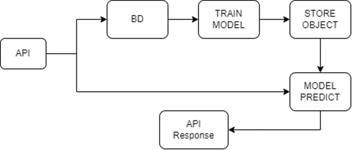 
</p>

### Como entregar esse projeto?
1. Crie um novo repositório no github com um nome a sua preferência
2. Crie um modelo de previsão com seus devidos pontos de extremidade configurados
3. Escreva o passo a passo desse processo em um readme.md de como você chegou nessa etapa4. Salve nesse repositório o readme.
4. Compartilhe conosco o link desse repositório através do botão 'entregar projeto' na plataforma da [DIO](https://web.dio.me/home)

### Instrutora
Valéria Baptista - [Linkedin](https://www.linkedin.com/in/valeriabaptista/)
<br>Head of Cloud and Cybersecurity, CloudData Tech & DevOps

### Links Importantes
- [Explore Automated Machine Learning in Azure Machine Learning](https://microsoftlearning.github.io/mslearn-ai-fundamentals/Instructions/Labs/01-machine-learning.html)
- [Explore Azure AI Services](https://microsoftlearning.github.io/mslearn-ai-fundamentals/Instructions/Labs/02-content-safety.html)

## Explorar o Machine Learning Automatizado no Azure Machine Learning


Primeiro passo é criar uma [subscrição do Azure](
https://azure.microsoft.com)

<p align="center">
    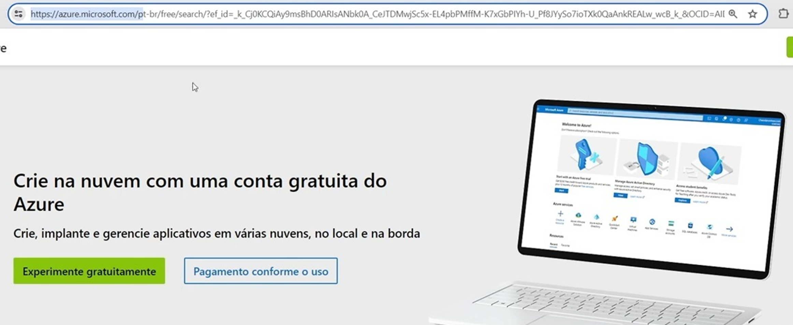 
</p>

Preencher o formulário. ⚠️ É necessário se cadastrar e ter um cartão de crédito 💳

<h1 align="center">
    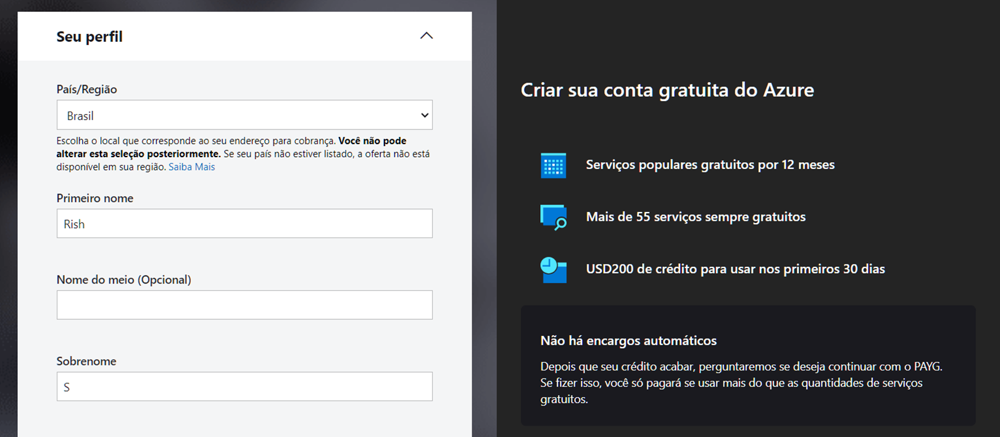 
    <br>
</h1>

Antes de começar a configurar o serviço de Machine learning iremos deixar criado um Grupo de Recursos, que auxiliará a organizarmos nossos recursos:
•	Resource group: LABAI-900
•	Name: laboratorioai900 (Create New)
•	Region: East US

<h1 align="center">
    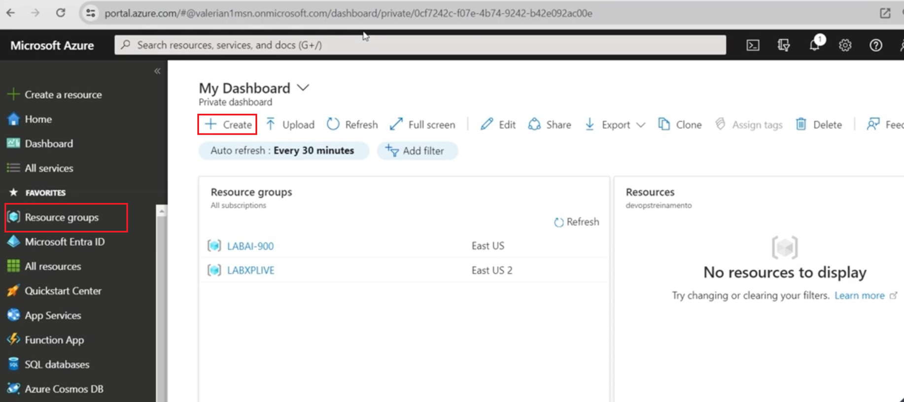 
    <br>
</h1>


Para utilizar o Azure Machine Learning, é necessário aprovisionar um espaço de trabalho do Azure Machine Learning na sua subscrição do Azure. Depois, você poderá usar o estúdio Azure Machine Learning para trabalhar com os recursos do seu workspace. Utilizaremos para isso o ML automatizado com as seguintes configurações:
1.	Método de treinamento
1.1 Treinar automaticamente
2.	Configurações básicas: dados preenchidos com descrição e tags.
3.	Tipos de dados
3.1 Selecionar tipo de tarefa: Regressão
3.2 Selecionar os dados: Adicionaremos o link do dataset
4.	Configurações de tarefas
4.1 Coluna de destino: Rentals
4.2 Exibir configurações de definição adicionais: desmarcar caixas e em modelos permitidos, selecionar Random Forest e Light GBM.
5.	Limites
5.1 Tipo de validação: divisão de validação de treinamento; Validação de percentual de dados :15%;
5.2 Dados de teste: divisão de teste de treinamento; Teste percentual de dados: 15%;
6.	Computação
7.	Configuração padrão, prosseguir.
8.	Por fim, enviamos para treinamento.

## Criar um espaço de trabalho do Azure Machine Learning


1.	Entre no portal do Azure em https://portal.azure.com usando suas credenciais da Microsoft.
2.	Selecione + Criar um recurso , pesquise Machine Learning e crie um novo recurso do Azure Machine Learning com as seguintes configurações:
 
<h1 align="center">
    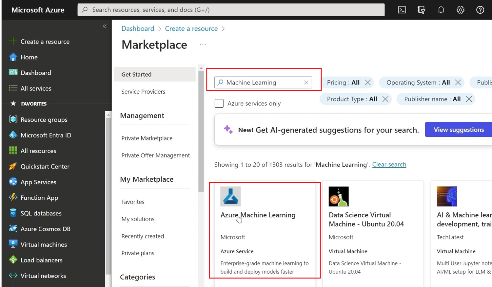 
    <br>
</h1>

o	Assinatura: Sua subscrição Azure.
o	Grupo de recursos: Crie ou selecione um grupo de recursos.
o	Nome: Insira um nome exclusivo para seu espaço de trabalho.
o	Região: Selecione a região geográfica mais próxima.
o	Conta de armazenamento: observe a nova conta de armazenamento padrão que será criada para seu espaço de trabalho.
o	Cofre de chaves: Observe o novo cofre de chaves padrão que será criado para seu espaço de trabalho.
o	Insights de aplicativo: observe o novo recurso padrão de insights de aplicativo que será criado para seu espaço de trabalho.
o	Registro de contêiner: Nenhum (um será criado automaticamente na primeira vez que você implantar um modelo em um contêiner).
 
<h1 align="center">
    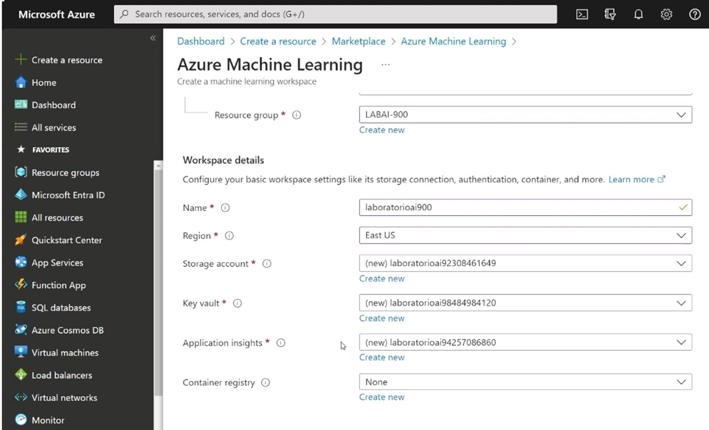 
    <br>
</h1>

3.	Selecione Revisar + criar e selecione Criar..
 
<h1 align="center">
    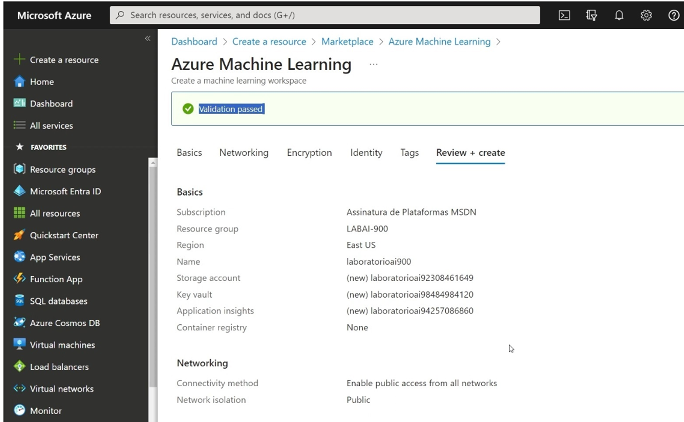 
    <br>
</h1>

4.	Aguarde a criação do seu espaço de trabalho (pode demorar alguns minutos)

 
<h1 align="center">
     
    <br>
</h1>


5.	Em seguida, vá para o recurso implantado.

 
<h1 align="center">
    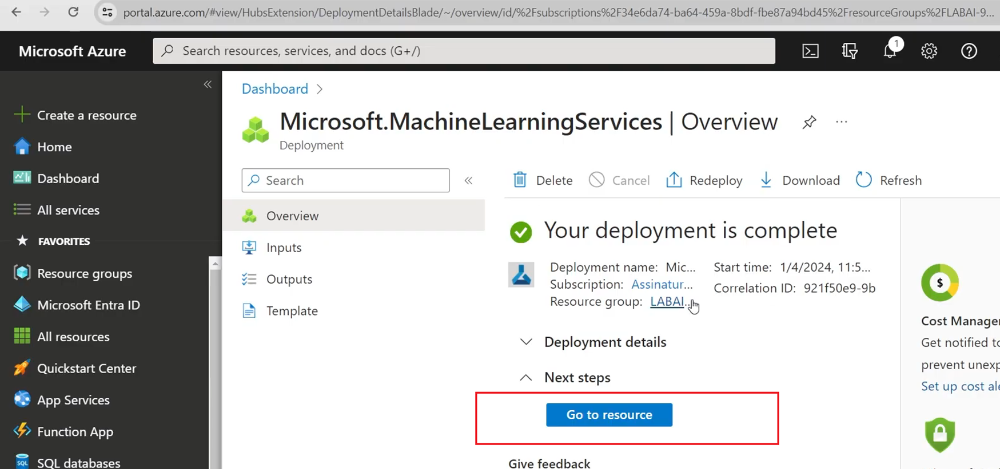 
    <br>
    <br>
</h1>
<h1 align="center">
    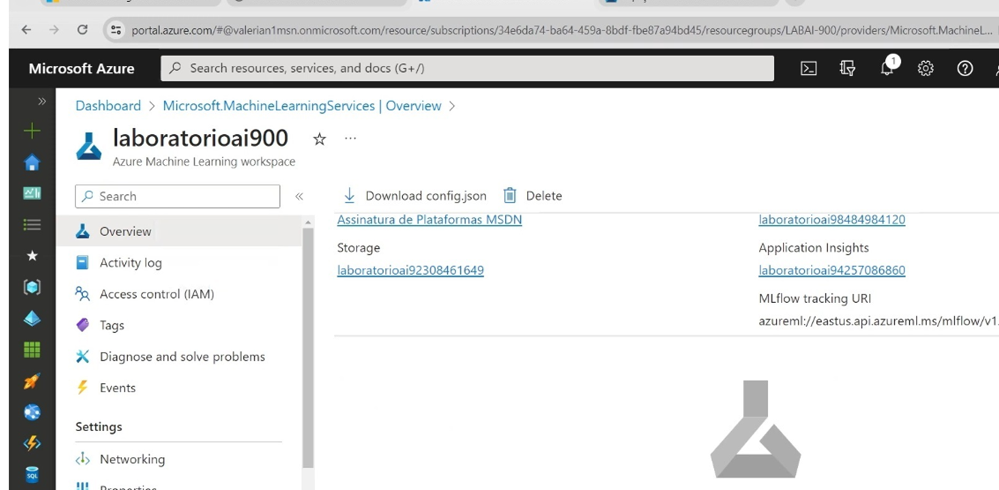 
    <br>
</h1>
 
6.	Selecione Launch Studio (ou abra uma nova guia do navegador e navegue até https://ml.azure.com e entre no Azure Machine Learning Studio usando sua conta da Microsoft). Feche quaisquer mensagens que são exibidos.
 
 <h1 align="center">
    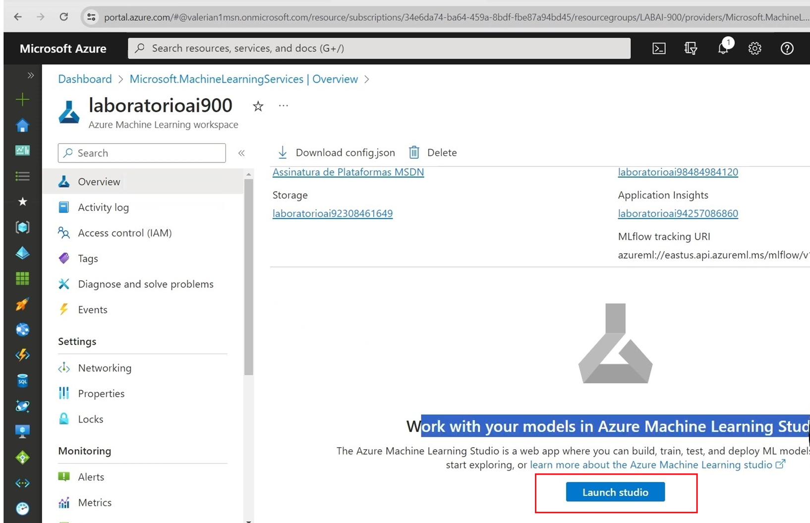 
    <br>
</h1>

<h1 align="center">
     
    <br>
</h1> 

7.	No estúdio Azure Machine Learning, você deverá ver seu espaço de trabalho recém-criado. Caso contrário, selecione Todos os espaços de trabalho no menu à esquerda e selecione o espaço de trabalho que você acabou de criar.

<h1 align="center">
    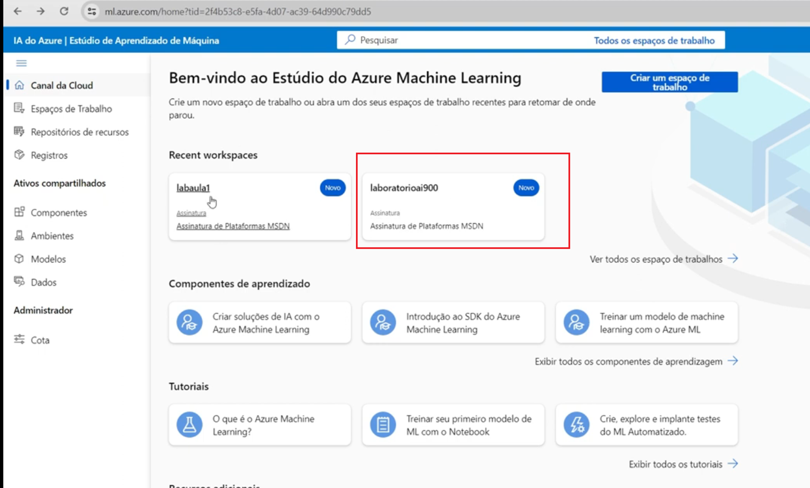 
    <br>
</h1> 

## Usar aprendizado de máquina automatizado para treinar um modelo


O aprendizado de máquina automatizado permite que você experimente vários algoritmos e parâmetros para treinar vários modelos e identificar o melhor para seus dados. Neste exercício, você usará um conjunto de dados de detalhes históricos de aluguel de bicicletas para treinar um modelo que prevê o número de aluguel de bicicletas esperado em um determinado dia, com base em características sazonais e meteorológicas. Os dados usados neste exercício são derivados da Capital Bikeshare (https://capitalbikeshare.com/system-data) e são usados de acordo com o contrato de licença de dados publicado (https://ride.capitalbikeshare.com/data-license-agreement)


1.	No Azure Machine Learning Studio , veja a página Automated ML (em Authoring ).
 

<h1 align="center">
    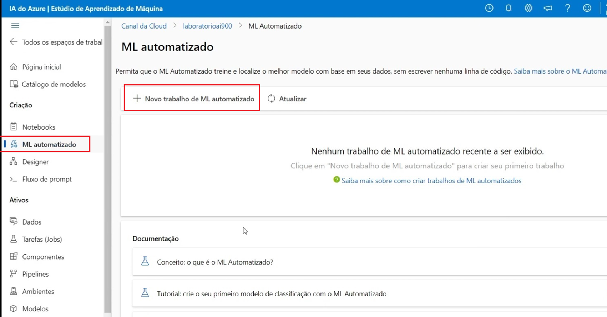 
    <br>
</h1> 

2.	Crie um novo trabalho de ML automatizado com as seguintes configurações, usando Next conforme necessário para avançar pela interface do usuário:
Configurações básicas:
o	Trabalho nome: mslearn-bike-automl
o	Nome do novo experimento: mslearn -bike-rental
o	Descrição: Aprendizado de máquina automatizado para previsão de aluguel de bicicletas
o	Marcadores: nenhum

<h1 align="center">
    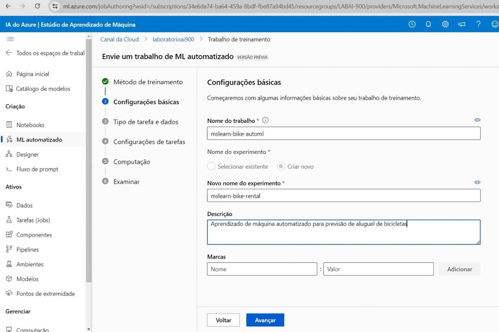 
    <br>
</h1> 

Tarefa tipo e dados:
o	Selecione tarefa tipo: Regressão
<h1 align="center">
    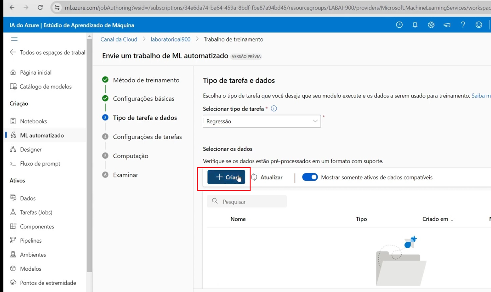 
    <br>
</h1> 

o	Selecionar conjunto de dados: crie um novo conjunto de dados com as seguintes configurações:
o	Tipo de dados:
	Nome: aluguel de bicicletas
	Descrição: Histórico bicicleta dados de aluguel
	Tipo: Tabular
<h1 align="center">
    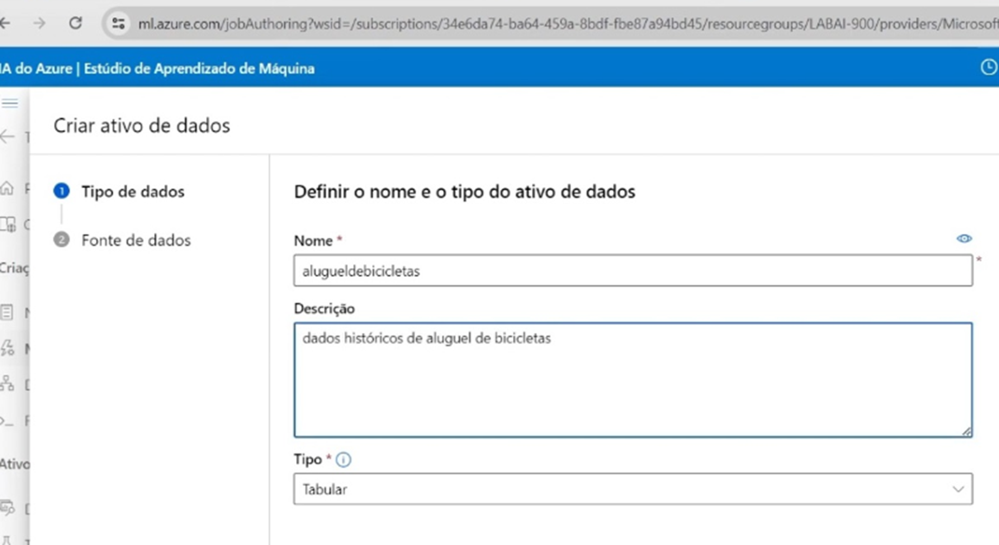 
    <br>
</h1> 

o	Fonte de dados:
	Selecione De arquivos da web
<h1 align="center">
    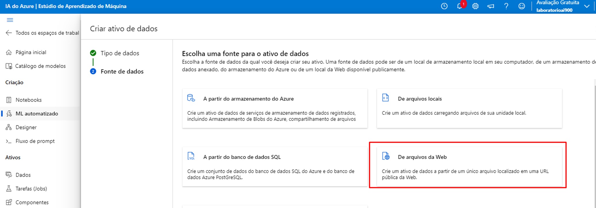 
    <br>
</h1> 

o	URL da Web:
	URL da Web: https://aka.ms/bike-rentals
	Ignorar validação de dados: não selecionar
 
<h1 align="center">
     
    <br>
</h1> 


o	Configurações:
	Formato de arquivo: Delimitado
	Delimitador: Vírgula
	Codificação: UTF-8
	Cabeçalhos de coluna: apenas o primeiro arquivo possui cabeçalhos
	Pular linhas: Nenhuma
	O conjunto de dados contém dados multilinhas: não selecione
 
<h1 align="center">
    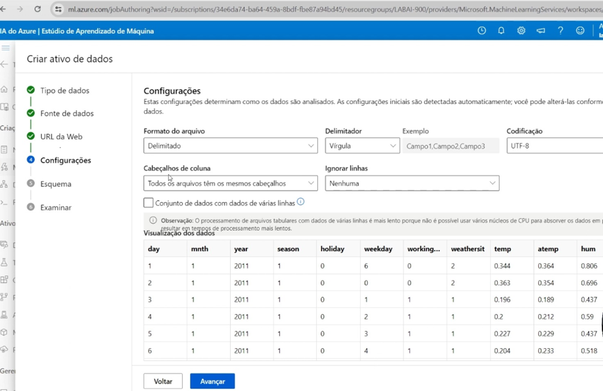 
    <br>
</h1> 

o	Esquema:
	Incluir todas as colunas exceto Caminho
	Análise o automaticamente detectou tipos
 
<h1 align="center">
    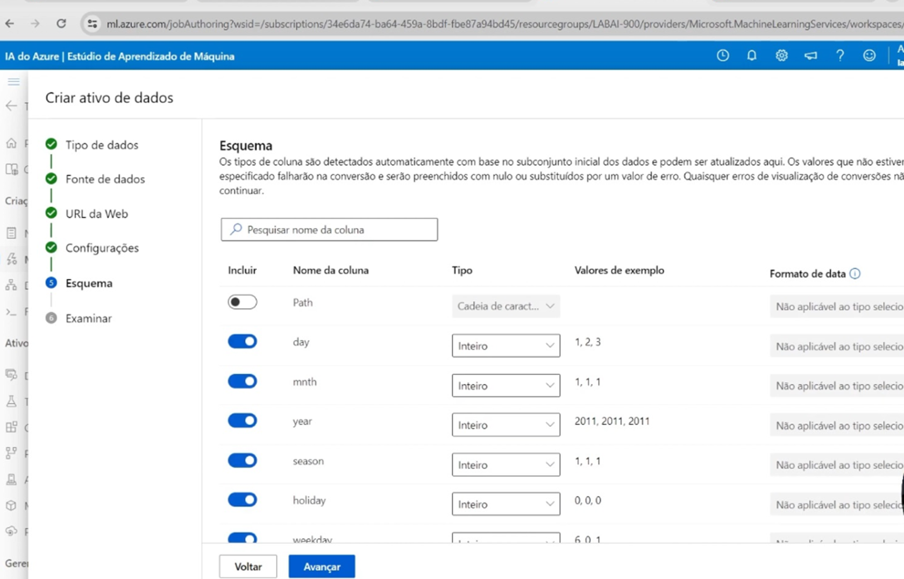 
    <br>
</h1> 


Selecione Criar. Após a criação do conjunto de dados, selecione o conjunto de dados de aluguel de bicicletas para continuar a enviar o trabalho de ML automatizado.
<h1 align="center">
    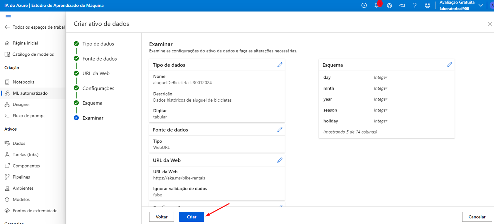 
    <br>
</h1> 


Configurações de tarefa:
o	Tarefa tipo: Regressão
o	Conjunto de dados: aluguel de bicicletas
o	Coluna de destino: Aluguéis (inteiro)
o	Adicional definições de configuração:
o	Métrica primária: raiz do erro quadrático médio normalizado
o	Explicar melhor modelo: Desmarcado
o	Usar todos os modelos suportados: Desmarcado. Você restringirá o trabalho para tentar apenas alguns algoritmos específicos.
o	Modelos permitidos: Selecione apenas RandomForest e LightGBM — normalmente você gostaria de tentar o máximo possível, mas cada modelo adicionado aumenta o tempo necessário para executar o trabalho.
<h1 align="center">
    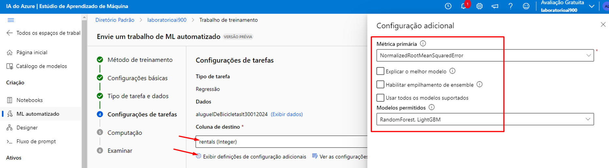 
    <br>
</h1> 

o	Limites: Expandir essa seção
o	Máximo de testes: 3
o	Máximo simultâneo testes: 3
o	Máximo de nós: 3
o	Limite de pontuação da métrica: 0,085 (para que, se um modelo atingir uma pontuação da métrica de erro quadrático médio normalizado de 0,085 ou menos, o trabalho termina.)
o	Tempo limite: 15
o	Tempo limite de iteração: 15
o	Habilitar cedo rescisão: selecionado
o	Validação e teste:
o	Validação tipo: Divisão de validação de treinamento
o	Percentagem de dados de validação: 10
o	Conjunto de dados de teste: Nenhum
<h1 align="center">
    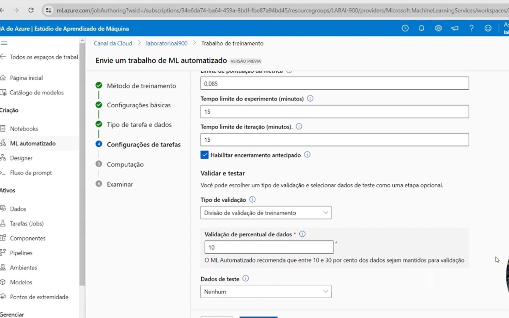 
    <br>
</h1> 


Computação:
o	Selecione o tipo de computação: sem servidor
o	Máquina virtual tipo: CPU
o	Máquina virtual nível: Dedicado
o	Tamanho da máquina virtual: Standard_DS3_V2*
o	Número de instâncias: 1
<h1 align="center">
    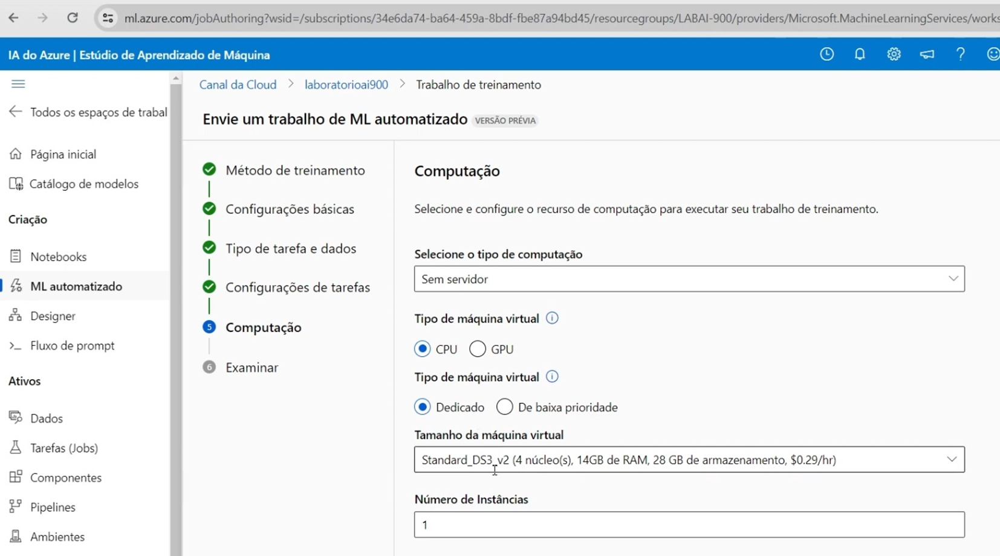 
    <br>
</h1> 


* Se a sua assinatura restringir os tamanhos de VM disponíveis para você, escolha qualquer tamanho disponível.
3.	Envie o trabalho de treinamento. Ele inicia automaticamente.
<h1 align="center">
     
    <br>
</h1> 

4.	Espere o trabalho terminar. Pode demorar um pouco
<h1 align="center">
    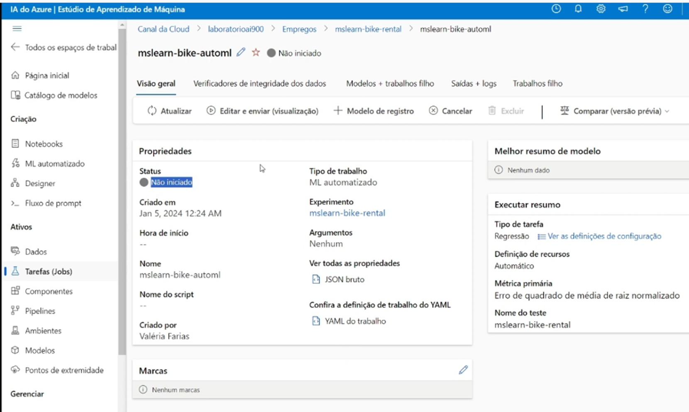 
    <br>
</h1> 


## Avaliar o modelo

Quando o trabalho automatizado de aprendizado de máquina for concluído, você poderá revisar o melhor modelo treinado.
1.	Na guia Visão geral do trabalho automatizado de aprendizado de máquina, observe o melhor resumo do modelo.
<h1 align="center">
    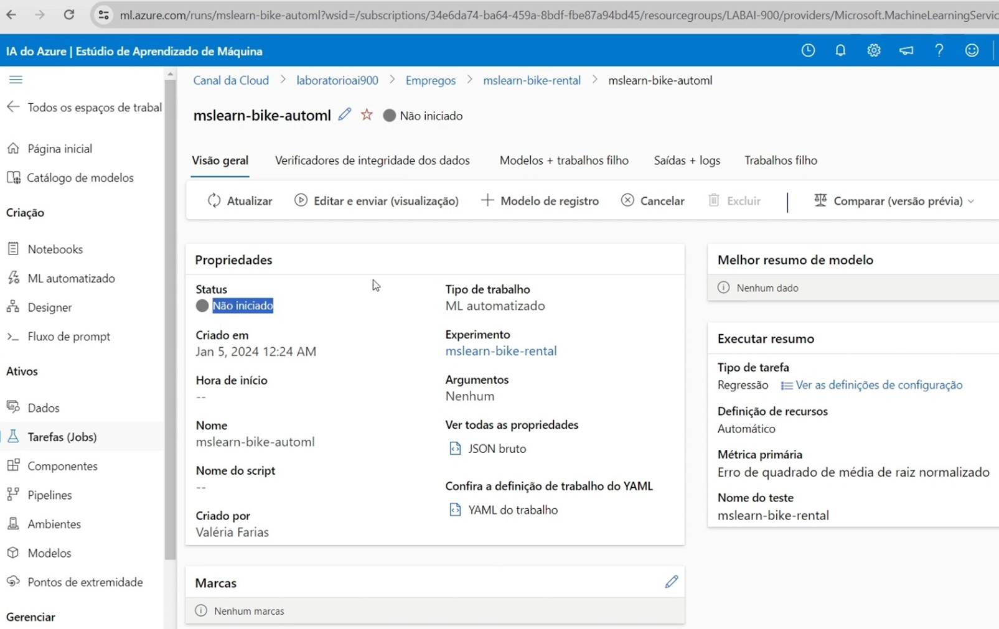 
    <br>
</h1> 

2.	Selecione o texto em Nome do algoritmo do melhor modelo para visualizar seus detalhes. 
<h1 align="center">
    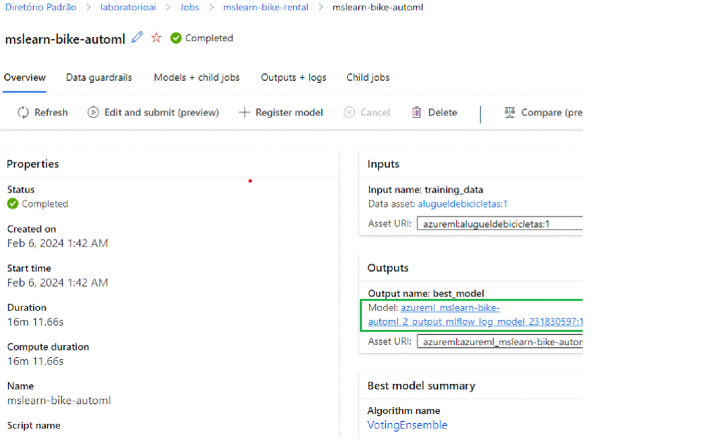 
    <br>
</h1> 

3.	Para acessar as métricas do modelo treinado, na página do modelo, acesso o link informado em "Criado por trabalho". 
<h1 align="center">
    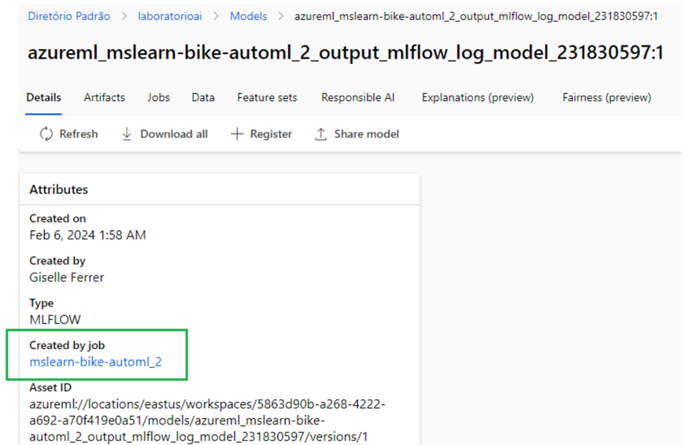 
    <br>
</h1> 

4.	Também é possível acessar o trabalho informado na opção do menu "Tarefas (jobs)". Há um Pipeline com as etapas do processo de aprendizado e os testes realizados
<h1 align="center">
    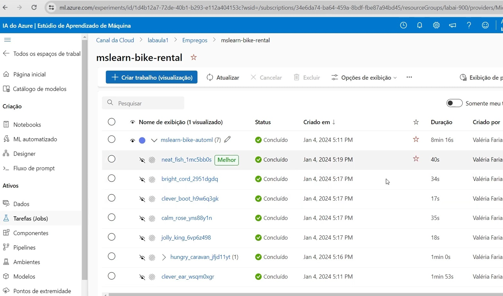 
    <br>
</h1> 

5.	Selecione a guia Métricas e selecione os gráficos residuais e predito_true se eles ainda não estiverem selecionados.
<h1 align="center">
    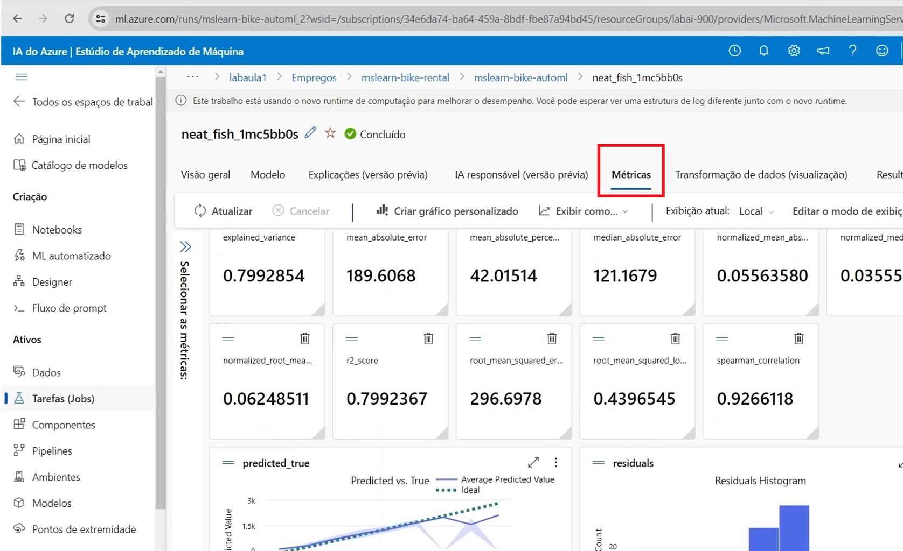 
    <br>
</h1> 

Revise os gráficos que mostram o desempenho do modelo. 
•	residuals mostra os resíduos (as diferenças entre os valores previstos e reais) como um histograma.
•	predicted_true compara os valores preditivos contra os valores verdadeiros.

 
## Implantar e testar o modelo


1.	 De volta à a guia Modelo do melhor modelo treinado pelo seu trabalho automatizado de machine learning, selecione Implantar e use a opção de serviço Web
<h1 align="center">
    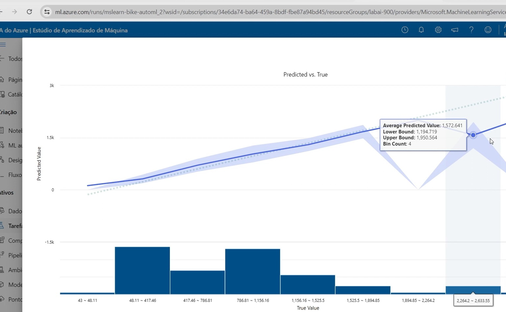 
    <br>
</h1> 

2.	Para implantar o modelo com as seguintes configurações:
o	Nome: prever-aluguéis
o	Descrição: Prever ciclo aluguéis
o	Tipo de computação: Instância de Contêiner do Azure
o	Habilitar autenticação: selecionado
<h1 align="center">
    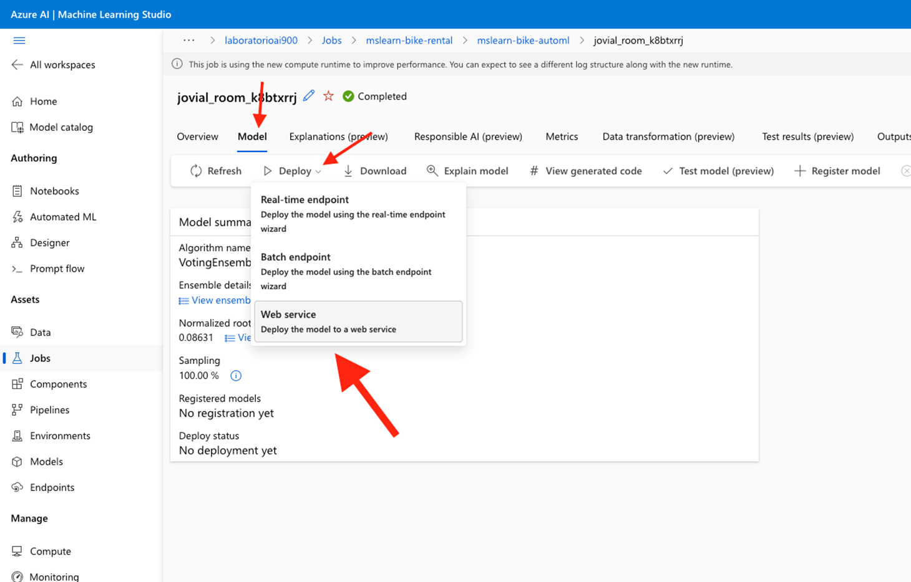 
    <br>
</h1> 

3.	Aguarde o início da implantação – isso pode levar alguns segundos. O status de implantação do endpoint de previsão de aluguel será indicado na parte principal da página como Running .
<h1 align="center">
    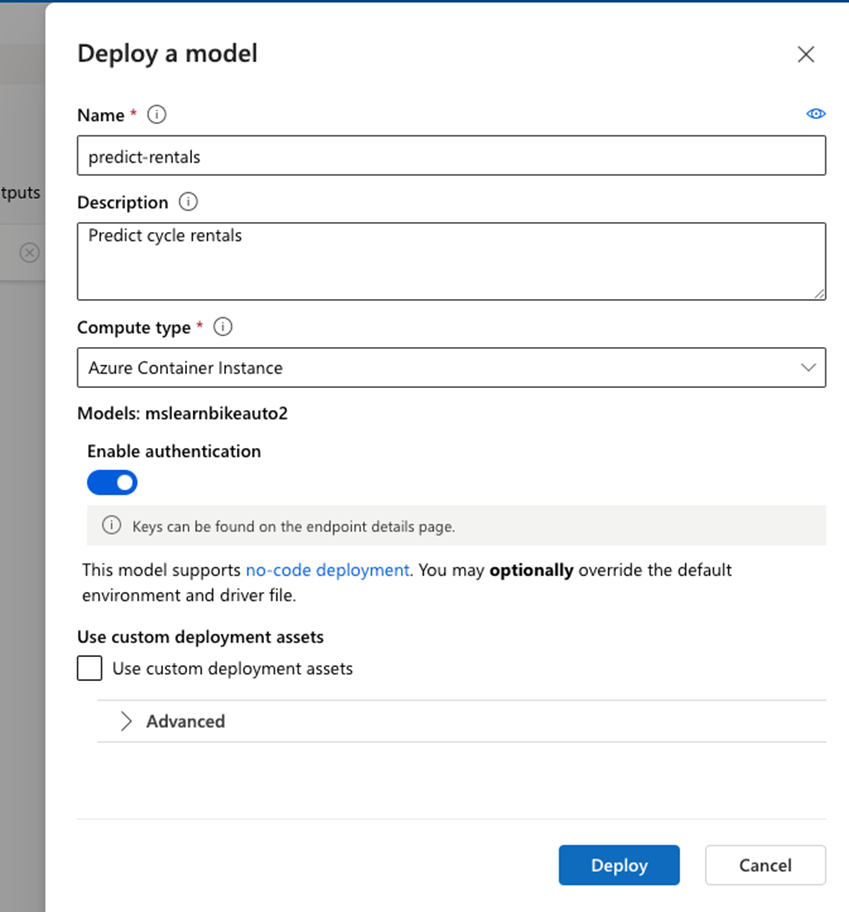 
    <br>
</h1> 

4.	Aguarde até que o status da implantação mude para Succeeded . Esse poderia leve de 5 a 10 minutos.
<h1 align="center">
    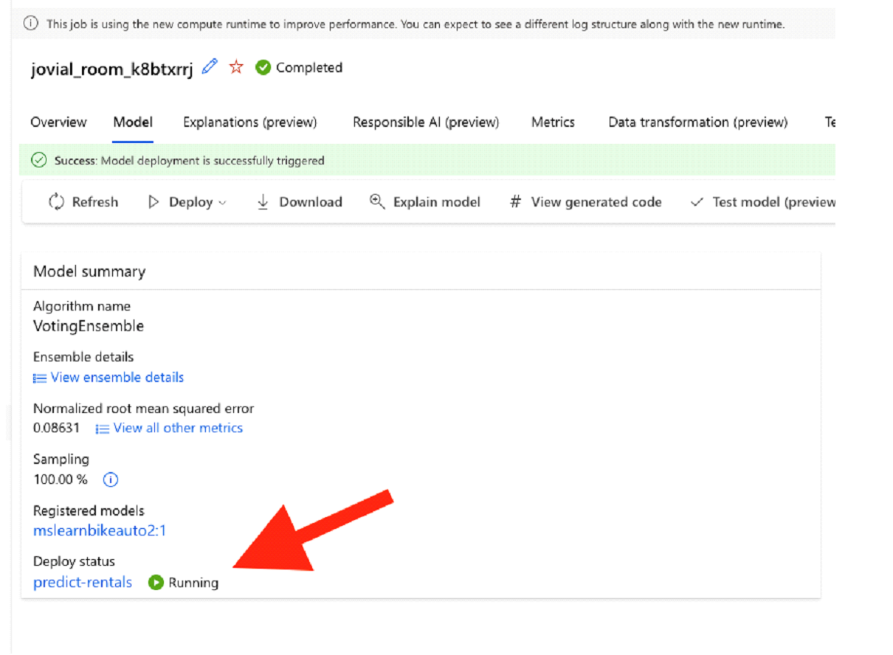 
    <br>
</h1> 
 

## Testar o serviço implantado 


Agora você pode testar seu serviço implantado.
1.	No estúdio Azure Machine Learning, no menu esquerdo, selecione Endpoints e abra o ponto final em tempo real de previsão de alugueis.
<h1 align="center">
    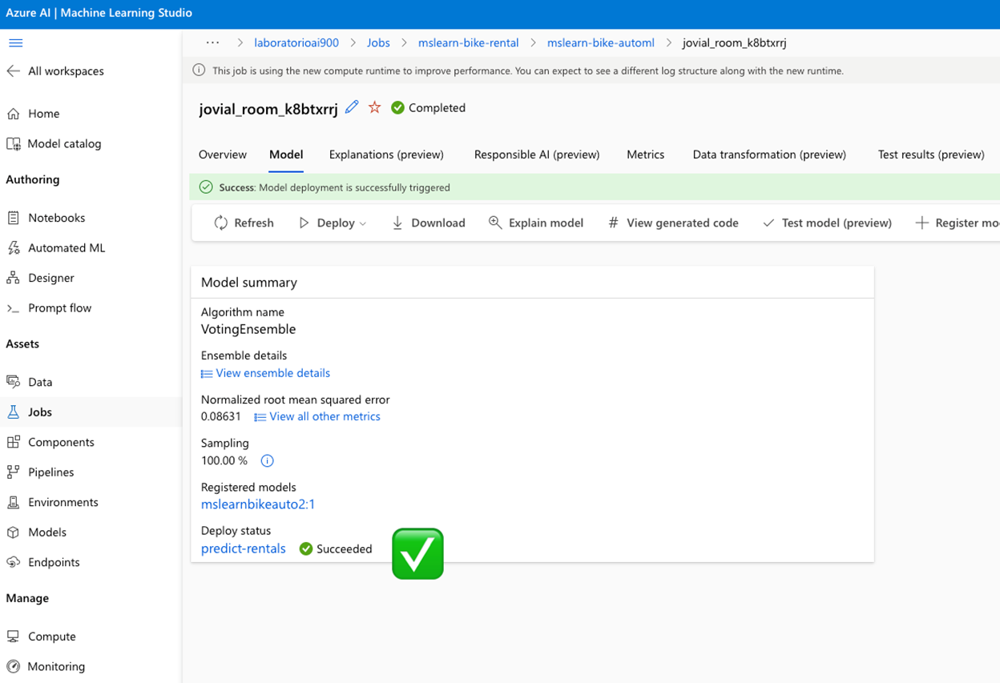 
    <br>
</h1> 

2.	Na tela de Endpoint, confirmamos o status "Succeed" do deploy, e clicamos na aba "Test"
<h1 align="center">
    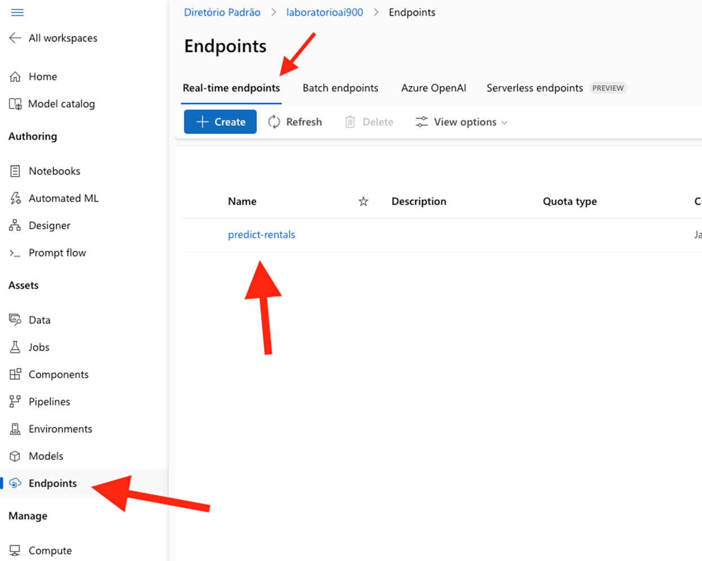 
    <br>
</h1> 

3.	Na página do endpoint em tempo real de previsão de aluguel, visualize a guia Teste.
<h1 align="center">
    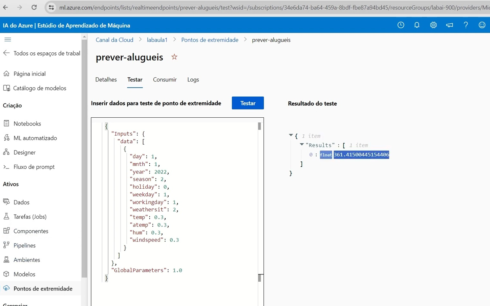 
    <br>
</h1> 

4.	No painel Dados de entrada para testar o endpoint , substitua o modelo JSON pelos seguintes dados de entrada:


``` JSON
{
  "Inputs": {
    "data": [
       {
         "day": 1,
         "mnth": 1,   
         "year": 2022,
         "season": 2,
         "holiday": 0,
         "weekday": 1,
         "workingday": 1,
         "weathersit": 2, 
         "temp": 0.3, 
         "atemp": 0.3,
         "hum": 0.3,
         "windspeed": 0.3 
       }
     ]
  },   
   "GlobalParameters": 1.0
}
```

5.	Clique no botão Testar .
6.	Revise os resultados do teste, que incluem um número previsto de aluguéis com base nos recursos de entrada - semelhante a este:

``` JSON
{
   "Resultados" : [
444.27799000000000
]
}
```

O painel Testar pegou os dados de entrada e usou o modelo treinado para retornar o número previsto de aluguéis. Vamos revisar o que você fez. Você usou um conjunto de dados históricos de aluguel de bicicletas para treinar um modelo. O modelo prevê o número de alugueres de bicicletas esperados num determinado dia, com base em características sazonais e meteorológicas.

## Limpar Recursos 

O serviço web que você criou está hospedado em uma instância de contêiner do Azure . Se não pretender experimentá-lo ainda mais, deverá eliminar o ponto final para evitar acumular utilização desnecessária do Azure.
1.	No estúdio Azure Machine Learning , na guia Endpoints , selecione o ponto de extremidade de previsão de aluguel . Em seguida, selecione Excluir e confirme que deseja excluir o endpoint.
2.	Excluir sua computação garante que sua assinatura não será cobrada por recursos de computação. No entanto, será cobrada uma pequena quantia pelo armazenamento de dados, desde que o espaço de trabalho do Azure Machine Learning exista na sua assinatura. Se tiver terminado de explorar o Azure Machine Learning, poderá eliminar o espaço de trabalho Azure Machine Learning e os recursos associados.

## Excluir Grupo de Recursos 

1. Acesse a página do portal e clique para abrir o menu lateral esquerdo:
<h1 align="center">
     
    <br>
</h1> 

2. Clique em "Resource Groups":
<h1 align="center">
     
    <br>
</h1> 

3. Selecione o grupo que deseja deletar:
<h1 align="center">
    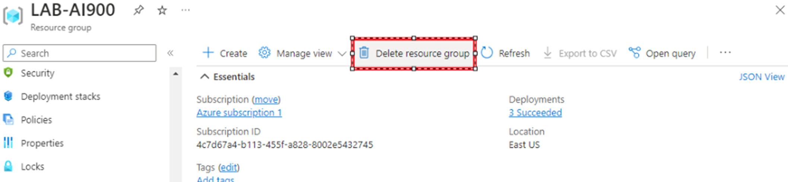 
    <br>
</h1> 

4. No ambiente do recurso referido, clique em "Delete resource group":
<h1 align="center">
    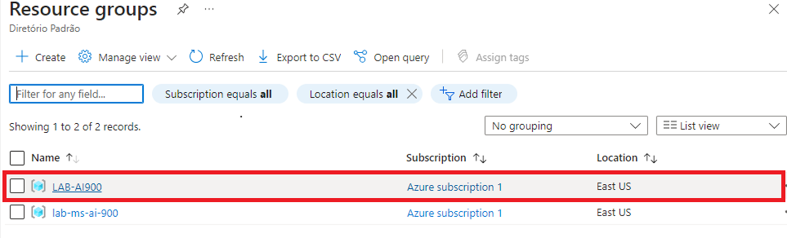 
    <br>
</h1> 

5. Confirme as informações, informe o nome do recurso no campo abaixo e clique em delete:
<h1 align="center">
     
    <br>
</h1> 

6. Confirme a exclusão:
<h1 align="center">
     
    <br>
</h1> 

<h1 align="center">
     
    <br>
</h1> 

Obs.: A exclusão pode demorar um pouco para acontecer. Aguarde um pouco e confira que o recurso foi excluído dando um refresh (F5) na página para que a lista de grupos de recursos seja atualizada.


Na última parte do vídeo a instrutora nos convida a visitar o site e explorar o serviço Azure AI Content Safety

## Explore os serviços de IA do Azure

Os serviços de IA do Azure ajudam os usuários a criar aplicativos de IA com APIs e modelos prontos para uso, pré-construídos e personalizáveis. Neste exercício, você verá um dos serviços, Azure AI Content Safety, no Content Safety Studio.

O Content Safety Studio permite explorar como o conteúdo de texto e imagem pode ser moderado. Você pode executar testes em amostras de texto ou imagens e obter uma pontuação de gravidade que varia de segura a alta para cada categoria. Neste exercício de laboratório, você criará um recurso de serviço único no Content Safety Studio e testará suas funcionalidades.

O objetivo deste exercício é obter uma noção geral de como os serviços de IA do Azure são provisionados e usados. Segurança de conteúdo é usada como exemplo, mas não se espera que você obtenha um conhecimento abrangente sobre segurança de conteúdo neste exercício!

## Navegar o Content Safety Studio

<h1 align="center">
    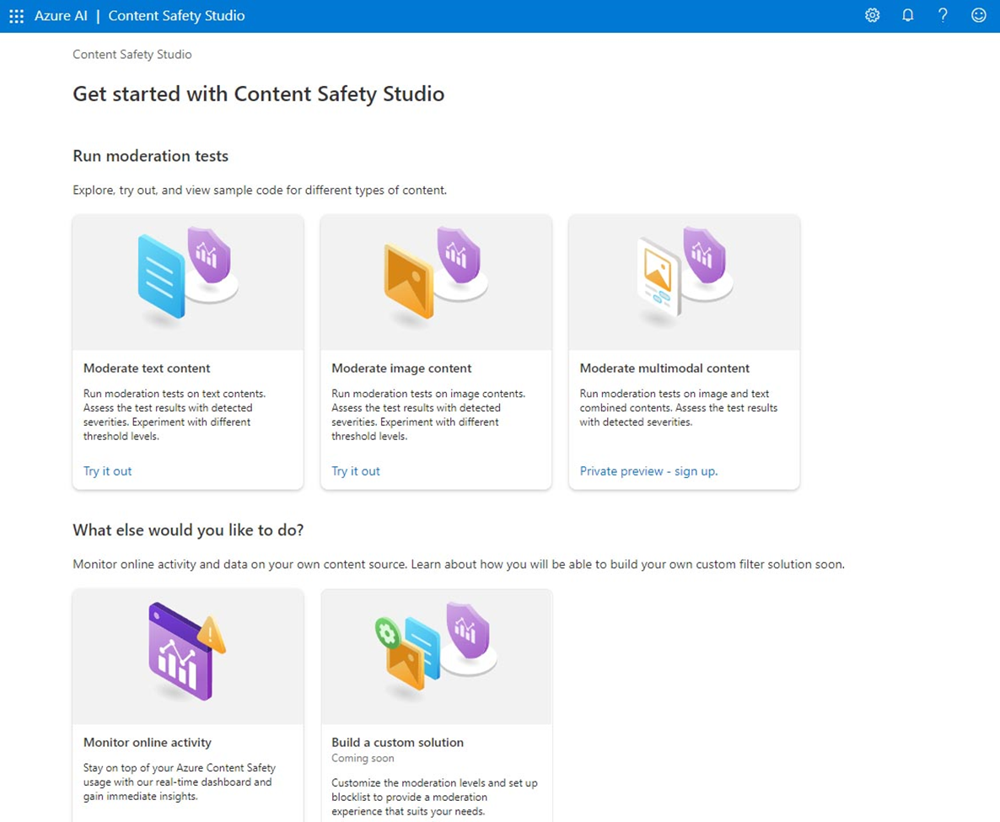 
    <br>
</h1> 

 
1.	Abra o Content Safety Studio . Se não estiver logado, você precisará fazer login. Selecione Entrar no canto superior direito da tela. Use o email e a senha associados à sua assinatura do Azure para entrar.
2.	O Content Safety Studio é configurado como muitos outros estúdios para serviços de IA do Azure. No menu na parte superior da tela, clique no ícone à esquerda do Azure AI . Você verá uma lista suspensa de outros estúdios projetados para desenvolvimento com os serviços de IA do Azure. Você pode clicar no ícone novamente para ocultar a lista.

<h1 align="center">
    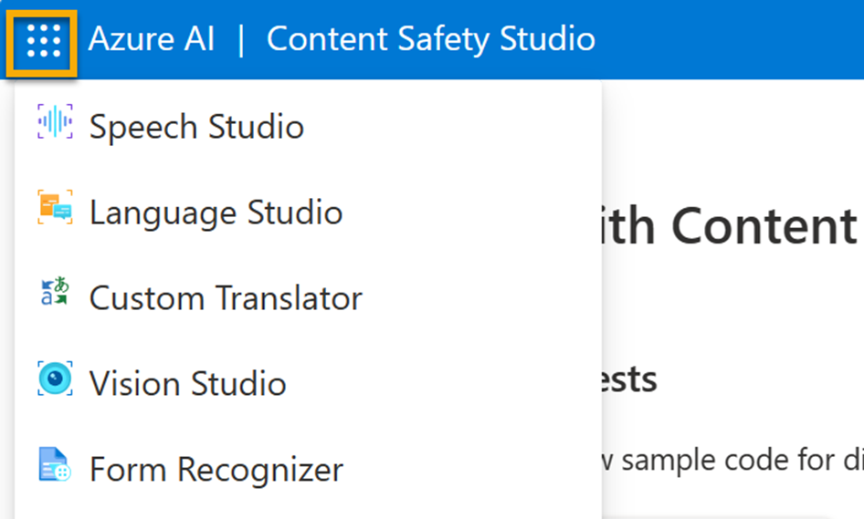 
    <br>
</h1> 


## Associar um recurso ao estúdio

Antes de utilizar o estúdio, é necessário associar um recurso de serviços Azure AI ao estúdio. Dependendo do estúdio, você pode achar que precisa de um recurso específico de serviço único ou pode usar um recurso geral de vários serviços. No caso do Content Safety Studio, você pode usar o serviço criando um recurso de segurança de conteúdo de serviço único ou um recurso geral de vários serviços do Azure AI . Nas etapas abaixo, criaremos um recurso de segurança de conteúdo de serviço único.
1.	No canto superior direito da tela, clique no ícone Configurações.
<h1 align="center">
     
    <br>
</h1> 

2.	Na página Configurações, você verá uma guia Diretório e uma guia Recursos. Na guia Recurso, selecione Criar um novo recurso. Isso leva você à página para criar um recurso no Portal do Azure.
3.	A guia Diretório permite que os usuários selecionem diferentes diretórios a partir dos quais criar recursos. Você não precisa alterar suas configurações, a menos que queira usar um diretório diferente.

<h1 align="center">
    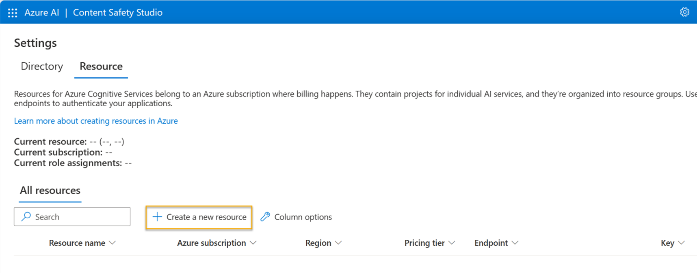 
    <br>
</h1> 

1.	Na página Criar Segurança de Conteúdo no Portal do Azure , você precisa configurar vários detalhes para criar seu recurso. Configure-o com o seguintes configurações:
o	Assinatura: Sua subscrição Azure .
o	Grupo de recursos: selecione ou crie um grupo de recursos com um nome exclusivo.
o	Região: Escolha qualquer região disponível.
o	Nome: Insira um nome exclusivo.
o	Preços nível: F0 grátis
2.	Selecione Revisar + Criar e revise a configuração. Em seguida, selecione Criar. A tela indicará quando a implantação for concluída.


Você acabou de criar ou provisionar um recurso de serviços de IA do Azure. Aquele que você provisionou em particular é um recurso de serviço de Segurança de Conteúdo de serviço único.
1.	Quando a implantação for concluída, abra uma nova guia e retorne ao Content Safety Studio .
2.	Selecione o ícone Configurações no canto superior direito da tela novamente. Desta vez, você verá que seu recurso recém-criado foi adicionado à lista.
3.	Na página Configurações do Content Safety Studio, selecione o recurso de serviço Azure AI que você acabou de criar e clique em Usar recurso na parte inferior da tela. Você será levado de volta à página inicial do estúdio. Agora você pode começar a usar o estúdio com o recurso recém-criado.

## Experimente a moderação de texto no Content Safety Studio

1.	Na página inicial do Content Safety Studio, em Executar testes de moderação, navegue até a caixa Moderar conteúdo de texto e clique em Experimentar.
2.	Em executar um teste simples, clique em Conteúdo seguro. Observe que o texto é exibido na caixa abaixo.
3.	Clique em Executar teste. A execução de um teste chama o modelo de aprendizagem profunda do Content Safety Service. O modelo de aprendizagem profunda já foi treinado para reconhecer conteúdo inseguro.
4.	No painel Resultados, inspecione os resultados. Existem quatro níveis de gravidade, de seguro a alto, e quatro tipos de conteúdo prejudicial. O serviço Content Safety AI considera esta amostra aceitável ou não? O que é importante observar é que os resultados estão dentro de um intervalo de confiança. Um modelo bem treinado, como um dos modelos prontos para uso do Azure AI, pode retornar resultados que têm uma alta probabilidade de corresponder ao que um humano rotularia o resultado. Cada vez que você executa um teste, você chama o modelo novamente.
5.	Agora tente outra amostra. Selecione o texto em Conteúdo violento com erros ortográficos. Verifique se o conteúdo é exibido na caixa abaixo.
6.	Clique em Executar teste e inspecione os resultados no painel Resultados novamente.
Você pode executar testes em todas as amostras fornecidas e depois inspecionar os resultados.

## Confira as chaves e o endpoint

Esses recursos que você testou podem ser programados em todos os tipos de aplicativos. As chaves e o endpoint usados para o desenvolvimento de aplicativos podem ser encontrados no Content Safety Studio e no Portal do Azure.
1.	No Content Safety Studio, navegue de volta para a página Configurações, com a guia Recursos selecionada. Procure o recurso que você usou. Role para ver o endpoint e a chave do seu recurso.
2.	No Portal do Azure, você verá que estes são o mesmo ponto final e chaves diferentes para o seu recurso. Para conferir, acesse o Portal do Azure . Pesquise Segurança de Conteúdo na barra de pesquisa superior. Encontre seu recurso e clique nele. No menu à esquerda, procure em Resource Management for Keys and Endpoints . Selecione Chaves e Pontos Finais para visualizar o ponto final e as chaves do seu recurso.
Depois de terminar, você poderá excluir o recurso Segurança de Conteúdo do Portal do Azure. Eliminar o recurso é uma forma de reduzir os custos acumulados quando o recurso existe na subscrição. Para fazer isso, navegue até a página Visão geral do seu recurso Segurança de conteúdo. Selecione Excluir no o topo da tela.


## Não encontrou sua resposta aqui? Tente esses repositórios...

### Repos Auxiliares
- [giselle-ferreira](
https://github.com/giselle-ferreira/ai-search-microsoft-azure)
- [alexklenio](
 https://github.com/alexklenio/DIO-Microsoft-Azure-AI-Fundamentals/tree/main/DP01%20-%20Trabalhando%20com%20Machine%20Learning)
- [francodof](
https://github.com/francodof/DIO-Microsoft-Azure-AI-Fundamentals/tree/main/Lab01-Azure-ML-Automated)


## 📜 License

O projeto publicado em 2024 sobre a licença [MIT](./LICENSE) ❤️ 

Made with ❤️ by Shyoutarou

Gostou? Deixe uma estrelinha para ajudar o projeto ⭐


