

      

<h1 align="center">
    
     Reconhecimento Facial e transformação de imagens em Dados
</h1>

## Utilizando Vision Studio - Passo a passo

Neste LAB, iremos praticar a criação de reconhecimento facial, identificação de dados em documentos e também o reconhecimento de elementos em imagens. Através desses exercícios, aprimoraremos nossas habilidades na aplicação prática de tecnologias de reconhecimento, proporcionando uma compreensão mais profunda e prática desses conceitos essenciais.

### Como entregar esse projeto?
1. Crie um novo repositório no github com um nome a sua preferência
2. Crie uma pasta chamada 'inputs' e salve as imagens que você utilizou
3. Crie uma pasta chamada 'output' e salve os resultados de reconhecimento de texto nessas imagens
4. Crie um arquivo chamado readme.md , deixe alguns prints descreva o processo, alguns insights e possibilidades que você aprendeu durante o conteúdo.
4. Compartilhe conosco o link desse repositório através do botão 'entregar projeto' na plataforma da [DIO](https://web.dio.me/home)

### Instrutora
**Valéria Baptista** - [Linkedin](https://www.linkedin.com/in/valeriabaptista/)
 Head of Cloud and Cybersecurity, CloudData Tech & DevOps

### Links Importantes
- [Detectar rostos no Vision Studio](https://microsoftlearning.github.io/mslearn-ai-fundamentals/Instructions/Labs/04-face.html)
- [Ler texto no Vision Studio](https://microsoftlearning.github.io/mslearn-ai-fundamentals/Instructions/Labs/05-ocr.html)
- [Analise imagens no Vision Studio](https://microsoftlearning.github.io/mslearn-ai-fundamentals/Instructions/Labs/03-image-análise.html)

## Detectar rostos no Vision Studio

Para testar as capacidades de deteção facial do serviço Azure AI Face, utilizará o Azure Vision Studio . Esta é uma plataforma baseada em UI que permite explorar os recursos do Azure AI Vision sem a necessidade de escrever nenhum código.

Crie um recurso de serviços de IA do Azure

Você pode usar o serviço Azure AI Face com um recurso multisserviço de serviços de IA do Azure . Se ainda não o fez, crie um recurso de serviços de IA do Azure na sua assinatura do Azure.
1.	Em outra guia do navegador, abra o portal do Azure em https://portal.azure.com , entrando com a conta da Microsoft associada à sua assinatura do Azure.
2.	Clique no botão ＋ Criar um recurso e pesquise os serviços de IA do Azure. Selecione criar um plano de serviços de IA do Azure. 

    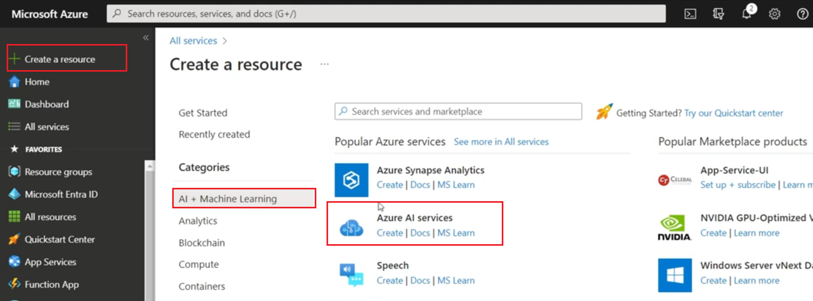 

3.	Você será levado a uma página para criar um recurso de serviços de IA do Azure. Configure-o com o seguintes configurações:
- Assinatura: Sua subscrição Azure.
- Grupo de recursos : selecione ou crie um grupo de recursos com um nome exclusivo .
- Região : Leste dos EUA.
- Nome : Insira um nome exclusivo .
- Preços nível : Padrão S0.
- Ao marcar esta caixa, confirmo que li e compreendi todos os termos abaixo: Selecionado.

    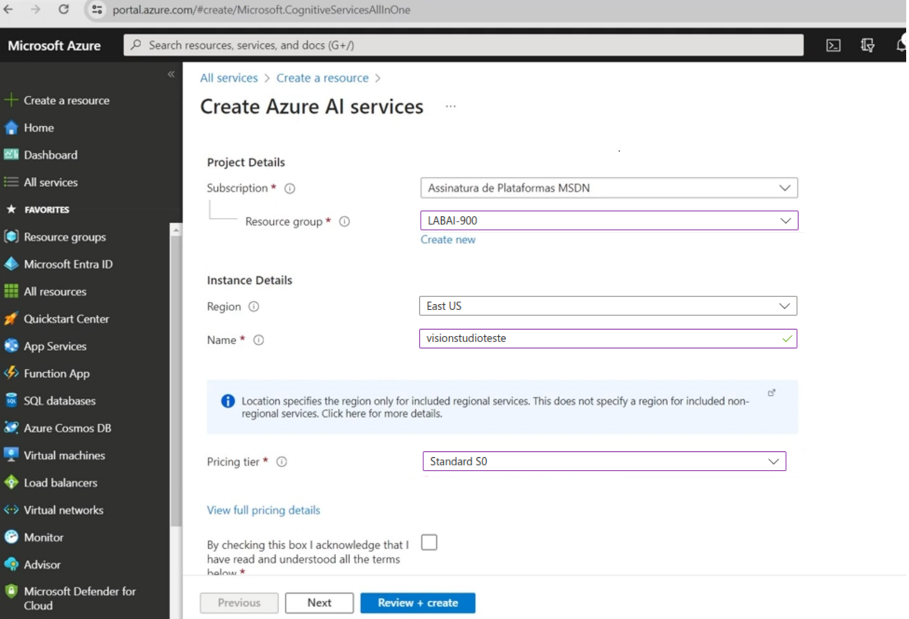 

4.	Selecione Revisar + criar e depois Criar e aguarde a conclusão da implantação.

Conecte seu recurso de serviço de IA do Azure ao Vision Studio
Em seguida, conecte o recurso de serviços de IA do Azure provisionado acima ao Vision Studio.
1.	Em outra guia do navegador, navegue até Vision Studio em https://portal.vision.cognitive.azure.com .

    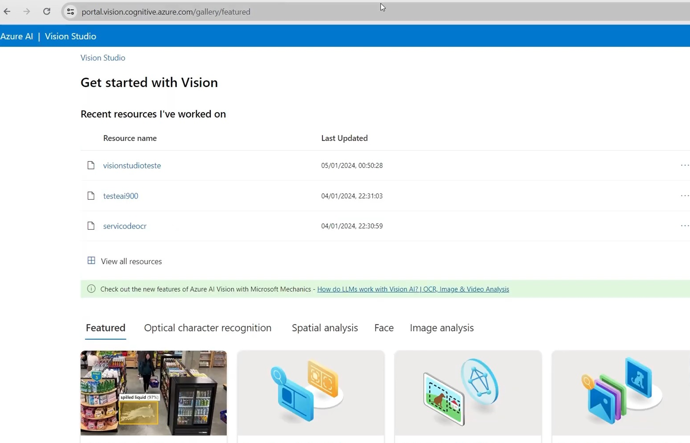 

2.	Entre com sua conta e certifique-se de usar o mesmo diretório onde você criou seu recurso de serviços de IA do Azure.
3.	Na página inicial do Vision Studio, selecione Visualizar todos os recursos no título Introdução ao Vision .

    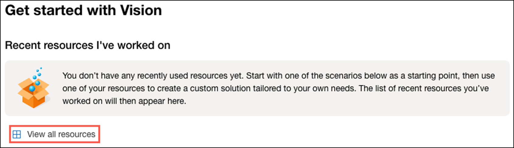 

4.	Na página Selecione um recurso para trabalhar , passe o cursor do mouse sobre o recurso que você criou acima na lista e marque a caixa à esquerda do nome do recurso e selecione Selecionar como recurso padrão .
Nota : Se o seu recurso não estiver listado, pode ser necessário atualizar a página.

     

5.	Feche a página de configurações selecionando o “x” no canto superior direito da tela.

## Detecte rostos no Vision Studio

1.	Num navegador web, navegue até Vision Studio em https://portal.vision.cognitive.azure.com .
2.	Na página inicial Introdução ao Vision, selecione a guia Face e, em seguida, selecione o bloco Detectar rostos em uma imagem.

    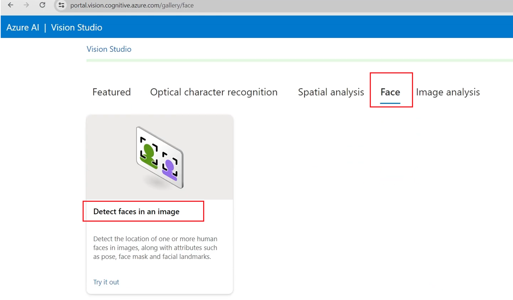 

3.	No subtítulo Experimente, reconheça a política de uso de recursos lendo e marcando a caixa.

    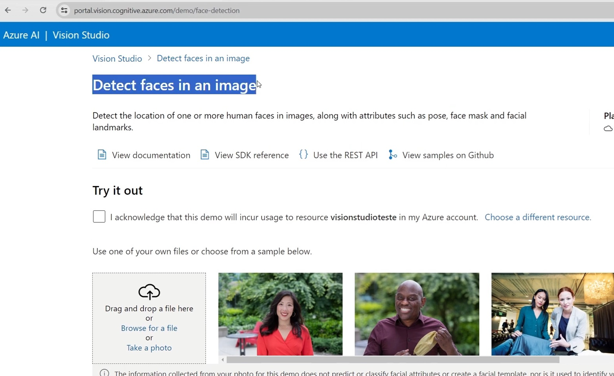 

4.	Selecione cada uma das imagens de amostra e observe os dados de detecção facial retornados.

    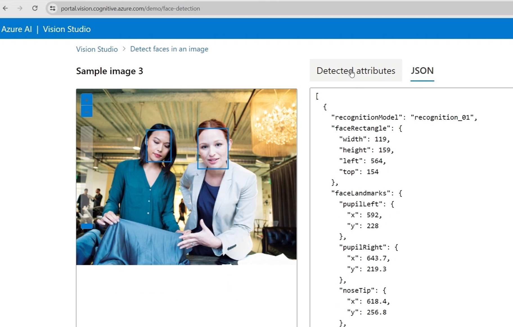 

5.	Agora vamos tentar com algumas de nossas próprias imagens. Selecione https://aka.ms/mslearn-detect-faces para baixar detect-faces.zip. Em seguida, abra a pasta no seu computador.
6.	Localize o arquivo chamado store-camera-1.jpg ; que contém a seguinte imagem. Faça upload de store-camera-1.jpg e revise os detalhes de detecção de rosto retornados.

    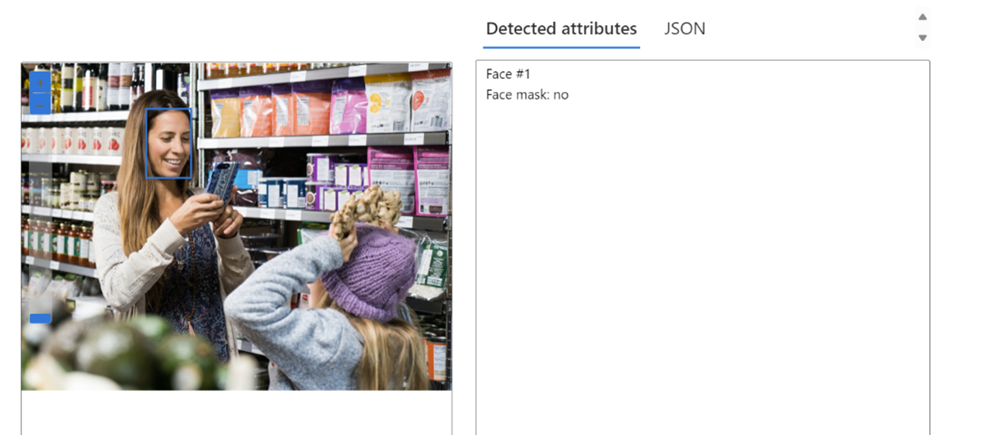 

7.	Localize o arquivo chamado store-camera-2.jpg ; que contém a seguinte imagem. Faça upload de store-camera-2.jpg e revise os detalhes de detecção de rosto retornados.

    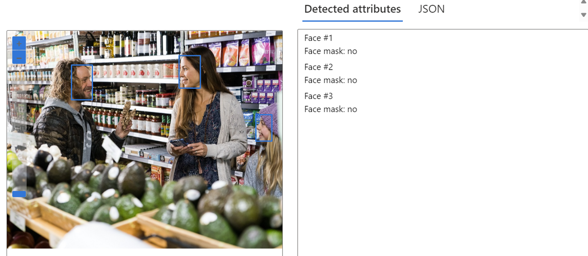 

8.	Localize o arquivo chamado store-camera-3.jpg ; que contém a seguinte imagem. Faça upload de store-camera-2.jpg e revise os detalhes de detecção de rosto retornados.

    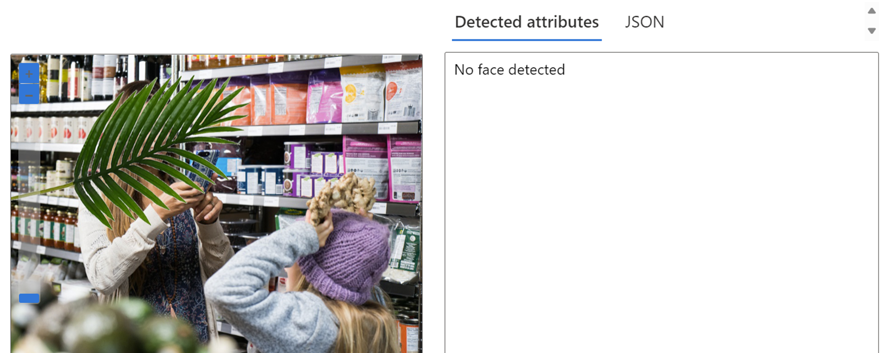 

9.	Observe como o Azure AI Face pode detectar rostos parcialmente obscurecidos.
Neste exercício você explorou como os serviços de IA do Azure podem detectar rostos em imagens. Se você tiver tempo, sinta-se à vontade para experimentar as imagens de exemplo ou algumas de suas próprias imagens.

## Ler texto no Vision Studio

Um desafio comum da visão computacional é detectar e interpretar texto incorporado em uma imagem. Isso é conhecido como reconhecimento óptico de caracteres (OCR). Neste exercício você usará um recurso de serviços de IA do Azure, que inclui serviços do Azure AI Vision. Em seguida, você usará o Vision Studio para testar o OCR com diferentes tipos de imagens.

Depois de criar um recurso de serviços de IA do Azure e de conectá-lo ao Vision Studio conforme vimos no exercício anterior

Texto de imagens no Vision Studio
1.	Num navegador web, navegue até Vision Studio em https://portal.vision.cognitive.azure.com .
2.	Na página inicial Introdução ao Vision, selecione Reconhecimento óptico de caracteres e, em seguida, o bloco Extrair texto de imagens.

    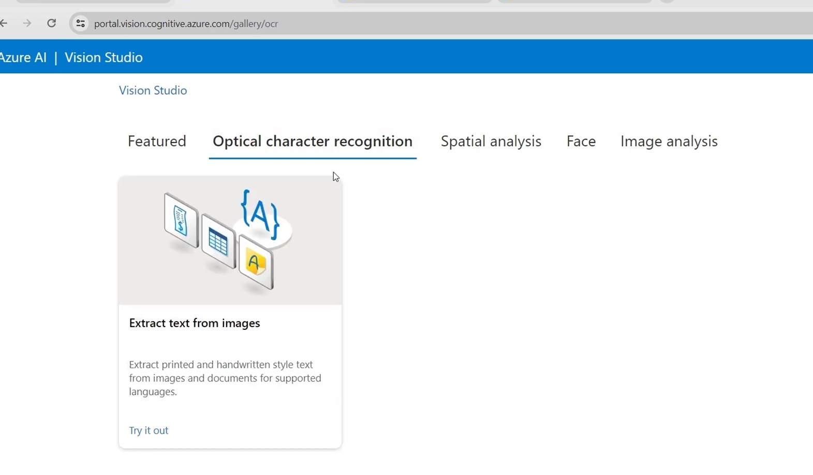 

3.	No subtítulo Experimente, reconheça a política de uso de recursos lendo e marcando a caixa.

    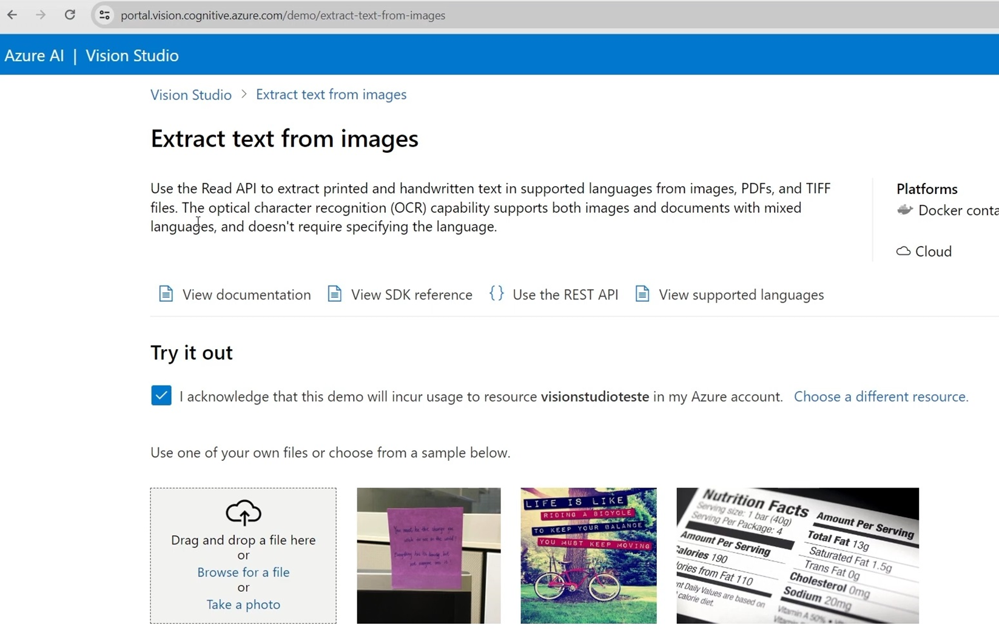 

4.	Selecione https://aka.ms/mslearn-ocr-images para baixar ocr-images.zip . Em seguida, abra a pasta.
5.	No portal, selecione Procurar um arquivo e navegue até a pasta em seu computador onde você baixou ocr-images.zip. Selecione advert.jpg e selecione Abrir .
6.	Agora revise o que é retornado:
- Nos atributos detectados , qualquer texto encontrado na imagem é organizado em uma estrutura hierárquica de regiões, linhas e palavras.
- Na imagem, a localização do texto é indicada por uma caixa delimitadora, conforme mostrado aqui:

    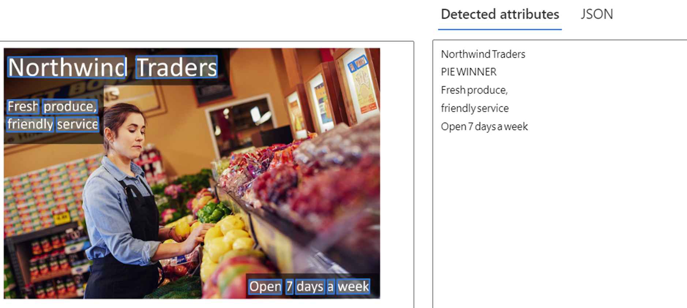 

7.	Agora você pode tentar outra imagem. Selecione Procurar um arquivo e navegue até a pasta onde você salvou os arquivos do GitHub. Selecione letter.jpg 

    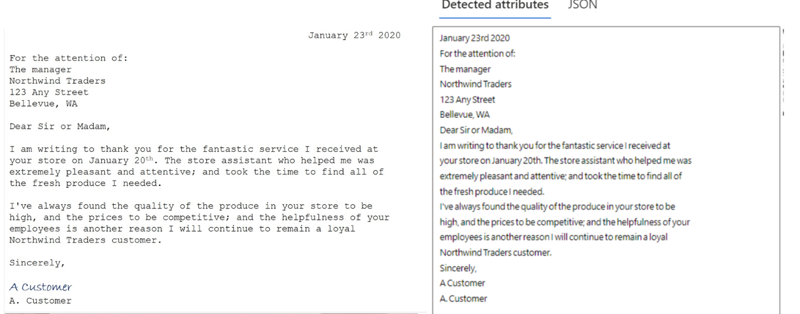 

8.	Revise os resultados da segunda imagem. Deve retornar o texto e as caixas delimitadoras do texto. Se você tiver tempo, tente carta.jpg e recibo.jpg .

    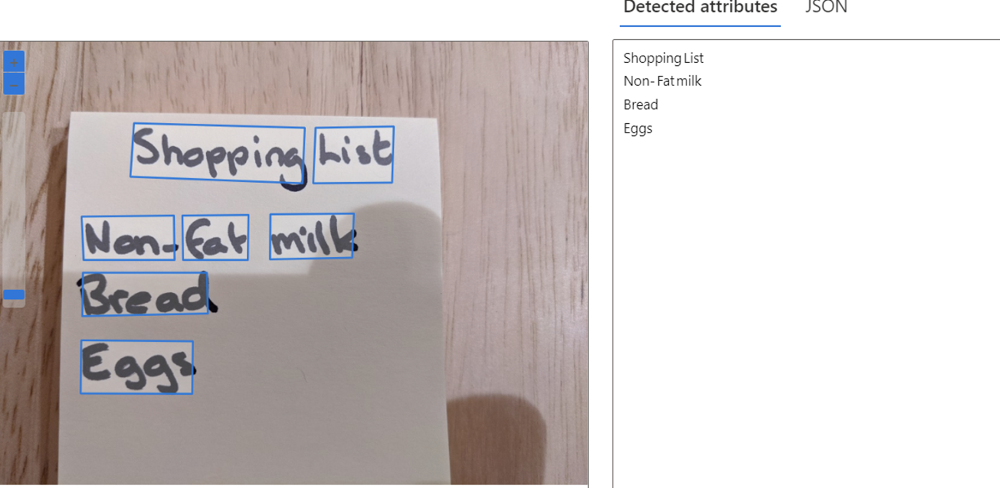 

## Analise imagens no Vision Studio

O Azure AI Vision inclui inúmeras capacidades para compreender o conteúdo e o contexto da imagem e extrair informações das imagens. O Azure AI Vision Studio permite-lhe experimentar muitas das capacidades de análise de imagens.

Depois de criar um recurso de serviços de IA do Azure e de conectá-lo ao Vision Studio conforme vimos no exercício anterior

Gerar legendas para uma imagem
.
Vejamos a funcionalidade de legenda de imagens do Azure AI Vision. As legendas das imagens estão disponíveis por meio dos recursos Legenda e Legendas densas .
1.	Em um navegador da web, navegue até Vision Studio .
2.	Na página inicial Introdução ao Vision , selecione a guia Análise de imagem e, em seguida, selecione o bloco Adicionar legendas às imagens .

    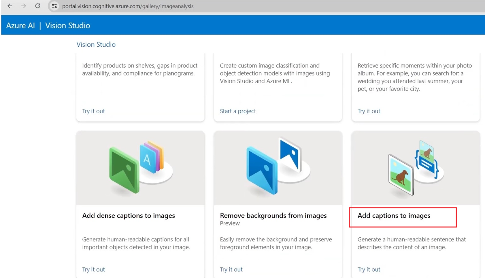 

3.	No subtítulo Experimente, reconheça a política de uso de recursos lendo e marcando a caixa.

     

4.	Selecione https://aka.ms/mslearn-images-for-analysis para baixar image-análise.zip . Abra a pasta no seu computador e localize o arquivo chamado store-camera-1.jpg; que contém a seguinte imagem:

     

5.	Carregue a imagem store-camera-1.jpg arrastando-a para a caixa Arrastar e soltar arquivos aqui ou navegando até ela em seu sistema de arquivos.
6.	Observe o texto da legenda gerado, visível no painel Atributos detectados à direita da imagem.
A funcionalidade Caption fornece uma única frase em inglês legível que descreve o conteúdo da imagem.
7.	Em seguida, use a mesma imagem para realizar legendas densas . Retorne à página inicial do Vision Studio e, como fez antes, selecione a guia Análise de imagem e, em seguida, selecione o bloco Legenda densa .
O recurso Dense Captions difere do recurso Caption porque fornece diversas legendas legíveis para uma imagem, uma descrevendo o conteúdo da imagem e outras, cada uma cobrindo os objetos essenciais detectados na imagem. Cada objeto detectado inclui uma caixa delimitadora, que define as coordenadas dos pixels na imagem associada ao objeto.
8.	Passe o mouse sobre uma das legendas na lista de atributos detectados e observe o que acontece na imagem.

    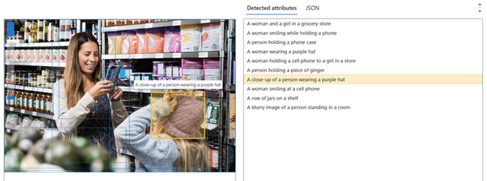 

Mova o cursor do mouse sobre as outras legendas da lista e observe como a caixa delimitadora muda na imagem para destacar a parte da imagem usada para gerar a legenda.

## Marcando imagens

O próximo recurso que você experimentará é a funcionalidade Extrair Tags. Extrair tags é baseado em milhares de objetos reconhecíveis, incluindo seres vivos, cenários e ações.
1.	Retorne à página inicial do Vision Studio e selecione o bloco Extrair tags comuns de imagens na guia Análise de imagem .
2.	Em Escolha o modelo que deseja experimentar , deixe selecionado Produto pré-construído vs. modelo de lacuna . Em Escolha seu idioma , selecione Inglês ou um idioma de sua preferência.
3.	Abra a pasta que contém as imagens que você baixou e localize o arquivo chamado store-image-2.jpg , que se parece com isto:

     

4.	Carregue o arquivo store-camera-2.jpg .
5.	Revise a lista de tags extraídas da imagem e a pontuação de confiança de cada uma no painel de atributos detectados. Aqui, a pontuação de confiança é a probabilidade de o texto do atributo detectado descrever o que realmente está na imagem. Observe na lista de tags que ela inclui não apenas objetos, mas ações, como compras , vendas e permanência .

     

## Detecção de objetos

Nesta tarefa, você usa o recurso de detecção de objetos da Análise de imagem. A detecção de objetos detecta e extrai caixas delimitadoras com base em milhares de objetos e seres vivos reconhecíveis.
1.	Retorne à página inicial do Vision Studio e selecione o bloco Detectar objetos comuns em imagens na guia Análise de imagem .
2.	Em Escolha o modelo que deseja experimentar , deixe selecionado Produto pré-construído vs. modelo de lacuna .
3.	Abra a pasta que contém as imagens que você baixou e localize o arquivo chamado store-camera-3.jpg , que se parece com isto:

     

4.	Carregue o arquivo store-camera-3.jpg .
5.	Na caixa Atributos detectados , observe a lista de objetos detectados e suas pontuações de confiança.
6.	Passe o cursor do mouse sobre os objetos na lista Atributos detectados para destacar a caixa delimitadora do objeto na imagem.
7.	Mova o controle deslizante Valor limite até que um valor de 70 seja exibido à direita do controle deslizante. Observe o que acontece com os objetos da lista. O controle deslizante de limite especifica que somente objetos identificados com uma pontuação de confiança ou probabilidade maior que o limite devem ser exibidos.

## Excluir Grupo de Recursos 

- [Evite cobranças com a conta gratuita do Azure](https://learn.microsoft.com/pt-br/azure/cost-management-billing/manage/avoid-charges-free-account)

Se não pretende fazer mais exercícios, exclua todos os recursos que não precisa mais. Esse evita acumulando qualquer desnecessário custos .

1. Acesse a página do portal e clique para abrir o menu lateral esquerdo:

     
     

 

2. Clique em "Resource Groups":

     
     

 

3. Selecione o grupo que deseja deletar:

     
     

 

4. No ambiente do recurso referido, clique em "Delete resource group":

     
     

 

5. Confirme as informações, informe o nome do recurso no campo abaixo e clique em delete:

     
     

 

6. Confirme a exclusão:

     
     

 

Obs.: A exclusão pode demorar um pouco para acontecer. Aguarde um pouco e confira que o recurso foi excluído dando um refresh (F5) na página para que a lista de grupos de recursos seja atualizada.

## Não encontrou sua resposta aqui? Tente esses repositórios...

### Repos Auxiliares
- [giselle-ferreira](https://github.com/giselle-ferreira/vision-studio-microsoft-azure)
- [alexklenio](https://github.com/alexklenio/DIO-Microsoft-Azure-AI-Fundamentals/tree/main/DP02%20-Vis%C3%A3o%20Computacional)
- [miguelfmds](https://github.com/miguelfmds/bootcamp-microsoft-azure-ai-fundamentals/tree/main/LAB02%20-%20Vis%C3%A3o%20Computacional)
- [wvdomingos](https://github.com/wvdomingos/DIO-Microsoft-Azure-AI-Fundamentals/tree/main/DP02%20-Vis%C3%A3o%20Computacional)
- [michaelssilva](https://github.com/michaelssilva/Bootcamp-DIO-AI-900/tree/main/Desafio%202)
- [casjunior93](https://github.com/casjunior93/Projeto-DIO---Reconhecimento-Facial-e-transformacao-de-imagens-em-Dados-no-Azure-ML)
- [colatto](https://github.com/colatto/AI-900-VisionStudio)

## 📜 License

O projeto publicado em 2024 sobre a licença [MIT](./LICENSE) ❤️ 

Made with ❤️ by Shyoutarou

Gostou? Deixe uma estrelinha para ajudar o projeto ⭐

