

      

<h1 align="center">
    
    Azure Cognitive Search: Utilizando AI Search para indexação e consulta de Dados
</h1>

## Utilizando IA Search - Passo a passo

Neste LAB, aplicaremos técnicas de organização de documentos e conduziremos pesquisas eficientes através da ingestão de dados, seguindo três passos essenciais: ingestão de conhecimento de IA, criação do índice correspondente e exploração dessas funcionalidades. Ao final, ganharemos uma visão prática das potencialidades oferecidas por essas ferramentas na mineração de conhecimento.

### Como entregar esse projeto?
1. Crie um novo repositório no github com um nome a sua preferência
2. Crie um arquivo readme.md descrevendo o passo a passo para se configurar uma pesquisa, assim como seus insights, possibilidades de ferramentas que se beneficiam com esse tipo de ferramenta e aprendizados adquiridos durante o processo. 
3. Compartilhe conosco o link desse repositório através do botão 'entregar projeto' na plataforma da [DIO](https://web.dio.me/home)

### Instrutora
**Valéria Baptista** - [Linkedin](https://www.linkedin.com/in/valeriabaptista/)
 Head of Cloud and Cybersecurity, CloudData Tech & DevOps

### Links Importantes
- [Explorar um Índice de Pesquisa de IA do Azure (IU)](https://microsoftlearning.github.io/mslearn-ai-fundamentals/Instructions/Labs/11-ai-search.html)

## Explore um índice do Azure AI Search (UI)

Você foi solicitado a ajudar a criar uma solução de mineração de conhecimento que facilite a busca de insights sobre as experiências dos clientes. Você decide criar um índice do Azure AI Search usando dados extraídos de avaliações de clientes.
Nisso _ laboratório você vai:
- Criar recursos Azure
- Extrair dados de uma fonte de dados
- Enriqueça os dados com habilidades de IA
- Utilize o indexador do Azure no portal do Azure
- Consulte seu índice de pesquisa
- Revise os resultados salvos em uma Loja de conhecimento

### Recursos do Azure necessários

A solução que você criará para o Fourth Coffee requer os seguintes recursos na sua assinatura do Azure:
- Um recurso do Azure AI Search , que gerenciará a indexação e a consulta.
- Um recurso de serviços de IA do Azure , que fornece serviços de IA para habilidades que sua solução de pesquisa pode usar para enriquecer os dados na fonte de dados com insights gerados por IA.
Nota Os recursos do Azure AI Search e dos serviços Azure AI devem estar no mesmo local!
- Uma conta de armazenamento com contêineres de blobs, que armazenará documentos brutos e outras coleções de tabelas, objetos ou arquivos.

## Crie um recurso do Azure AI Search

1.	Entre no portal do Azure .
2.	Clique no botão + Criar um recurso, pesquise Azure AI Search 

    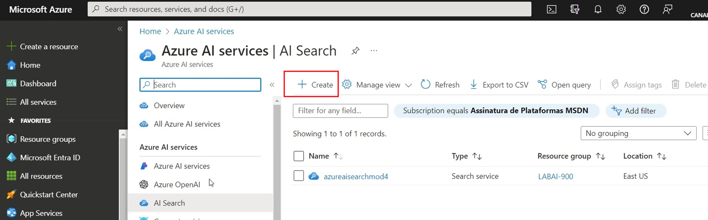 

3.	Crie um Recurso Azure AI Search com as seguintes configurações:
- Assinatura: Sua subscrição Azure .
- Grupo de recursos: selecione ou crie um grupo de recursos com um nome exclusivo .
- Nome do serviço: um nome exclusivo .
- Localização: Escolha qualquer região disponível .
- Preços nível: Básico

    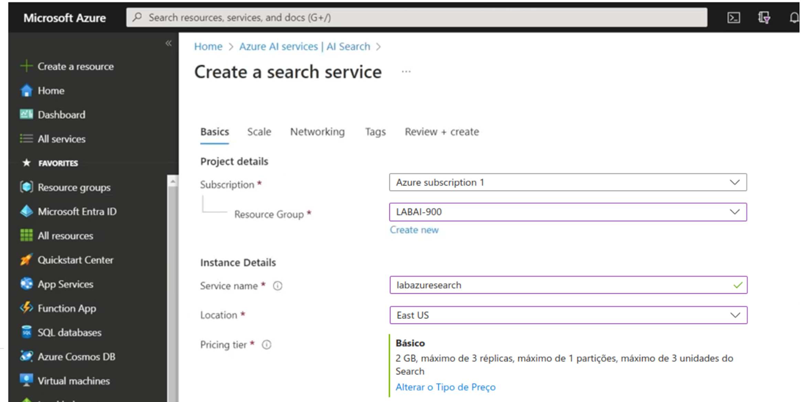 

 

    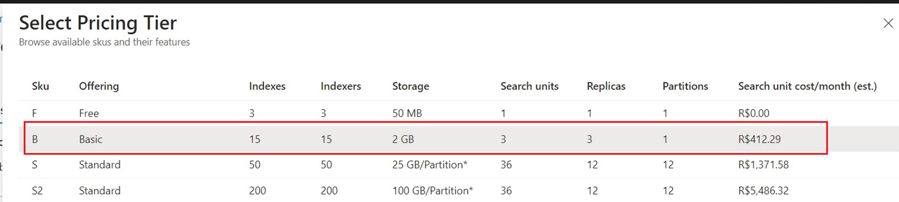 

4.	Selecione Review + create e depois de ver a resposta Validation Success , selecione Create .

    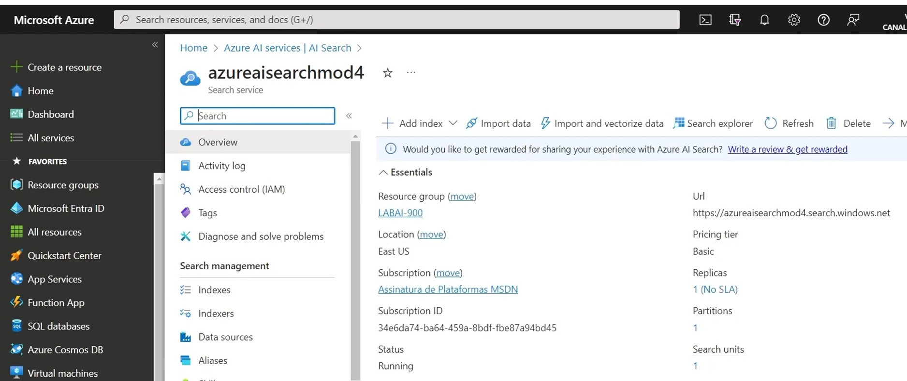 

5.	Após a conclusão da implantação, selecione Ir para o recurso . Na página de visão geral do Azure AI Search, você pode adicionar índices, importar dados e pesquisar índices criados.

## Crie um recurso de serviços de IA do Azure

Você precisará provisionar um recurso de serviços de IA do Azure que esteja no mesmo local que seu recurso do Azure AI Search. Sua solução de pesquisa usará esse recurso para enriquecer os dados no armazenamento de dados com insights gerados por IA.
1.	Retorne à página inicial do portal do Azure. Clique no botão ＋ Criar um recurso e pesquise os serviços de IA do Azure . Selecione criar um plano de serviços de IA do Azure . 

     

2.	Você será levado a uma página para criar um recurso de serviços de IA do Azure. Configure-o com o seguintes configurações:
- Assinatura: Sua subscrição Azure.
- Grupo de recursos: O mesmo grupo de recursos que seu recurso do Azure AI Search .
- Região: o mesmo local do recurso do Azure AI Search .
- Nome: Um único nome .
- Preços nível : Padrão S0
- Ao marcar esta caixa, confirmo que li e compreendi todos os termos abaixo: Selecionado

    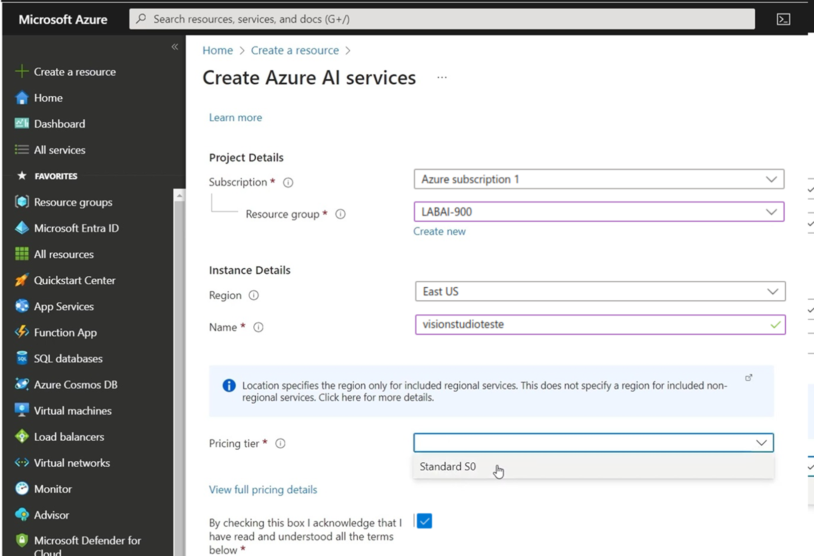 

3.	Selecione Revisar + criar . Depois de ver a resposta Validation Passed , selecione Create .
4.	Aguarde a conclusão da implantação e visualize os detalhes da implantação.

## Crie um armazenamento conta

1.	Retorne à página inicial do portal do Azure e selecione o botão + Criar um recurso .

    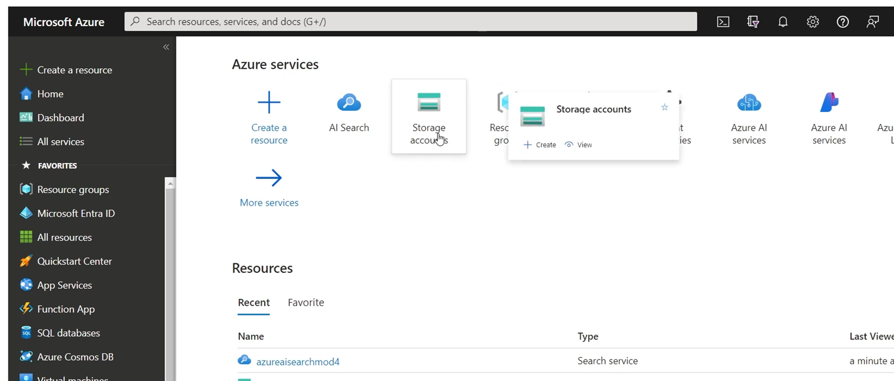 

2.	Procure conta de armazenamento

    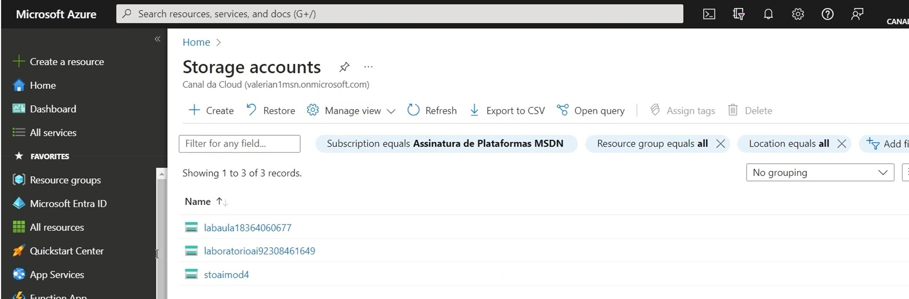 

3.	Crie um recurso de conta de armazenamento com as seguintes configurações:
- Assinatura: Sua subscrição Azure.
- Grupo de recursos: O mesmo grupo de recursos que os recursos do Azure AI Search e dos serviços Azure AI.
- Nome da conta de armazenamento: um nome exclusivo.
- Localização: Escolha qualquer localização disponível.
- Padrão de desempenho
- Redundância: armazenamento localmente redundante (LRS)

    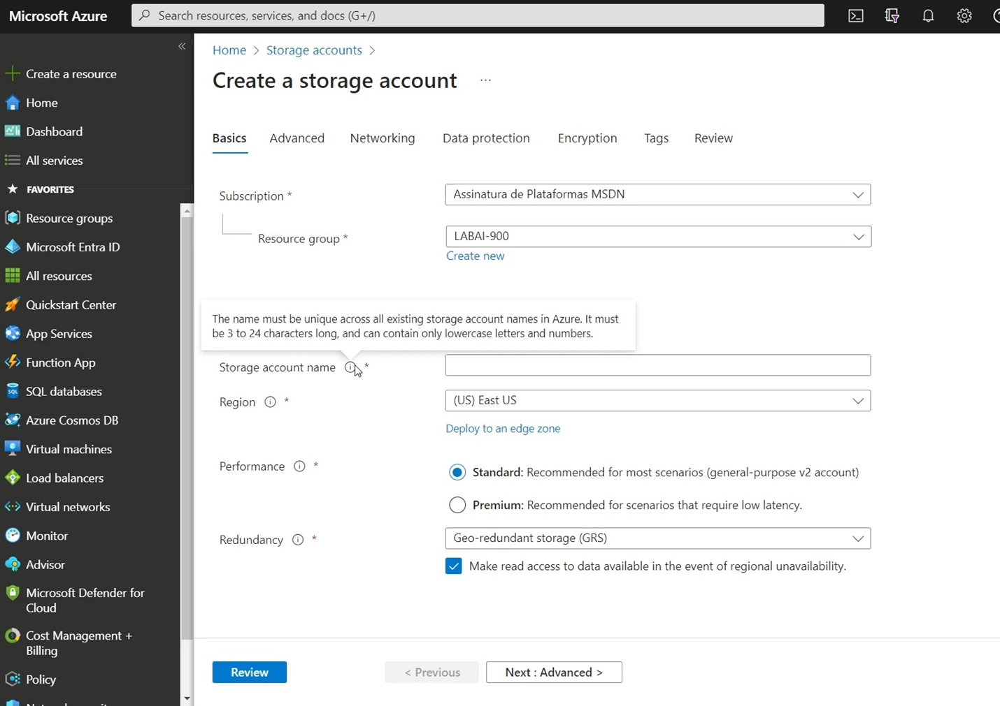 

    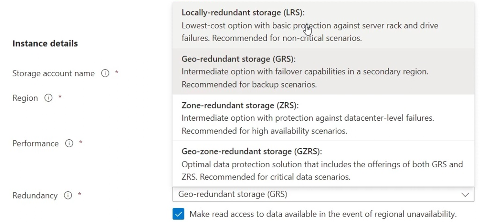 

4.	Clique em Revisar e em Criar. Aguarde a conclusão da implantação e vá para o recurso implantado.

    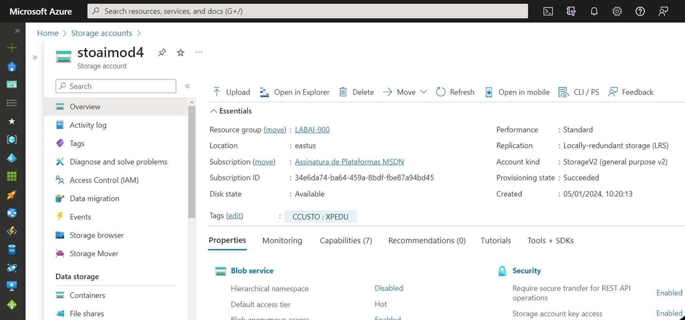 

5.	Na conta de Armazenamento do Azure que você criou, no painel de menu esquerdo, selecione Configuração (em Configurações).

    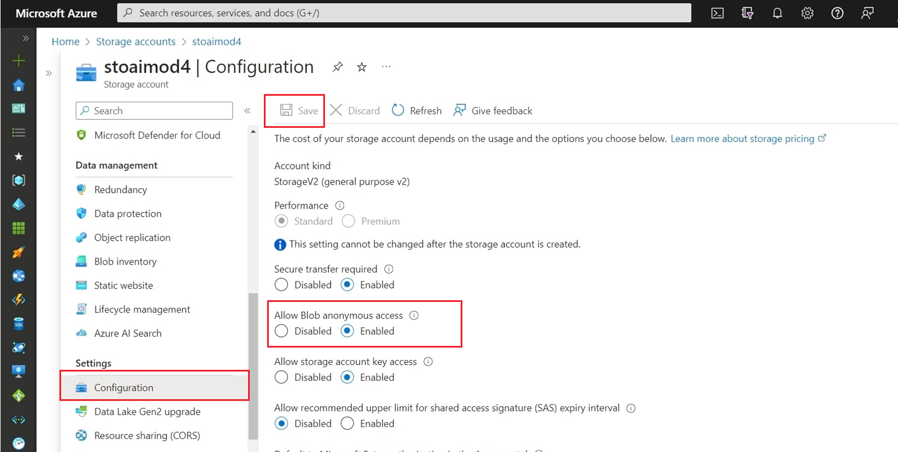 

6.	Altere a configuração de Permitir acesso anônimo de Blob para Habilitado e selecione Salvar .

## Carregar documentos para Armazenamento Azure

1.	No painel do menu esquerdo, selecione Containers.

    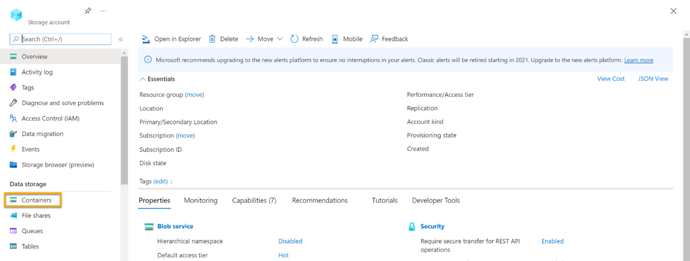 

2.	Selecione + Contêiner. Um painel do seu lado direito é aberto.
3.	Insira as seguintes configurações e clique em Criar:
- Nome: Coffee-Reviews
- Nível de acesso público: Container (acesso de leitura anônimo para containers e blobs)
- Avançado: sem alterações.

    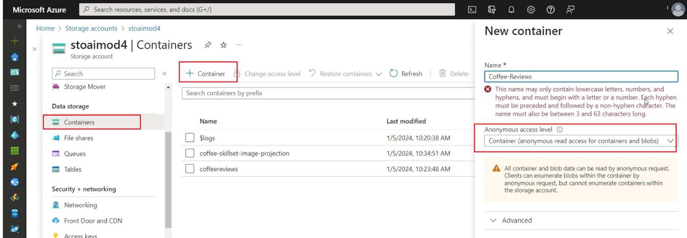 

4.	Em uma nova guia do navegador, baixe as avaliações compactadas do café em https://aka.ms/mslearn-coffee-reviews e extraia os arquivos para a pasta de avaliações .
5.	No portal do Azure, selecione o contêiner de avaliações de café. No contêiner, selecione Carregar .

    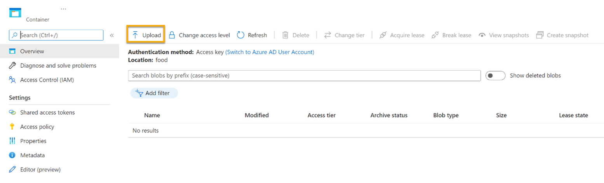 

6.	No painel Carregar blob , selecione Selecionar um arquivo .
7.	Na janela do Explorer, selecione todos os arquivos na pasta de avaliações, selecione Abrir e, em seguida, selecione Carregar.

    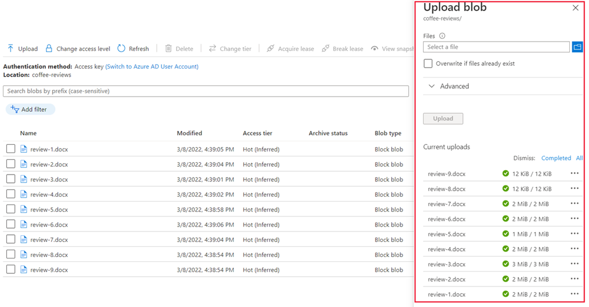 

8.	Depois que o upload for concluído, você poderá fechar o painel Upload blob . Seus documentos estão agora em seu contêiner de armazenamento de avaliações de café.

## Indexar os documentos

Depois de armazenar os documentos, você poderá usar o Azure AI Search para extrair insights dos documentos. O portal do Azure fornece um assistente de importação de dados. Com este assistente, você pode criar automaticamente um índice e um indexador para fontes de dados suportadas. Você usará o assistente para criar um índice e importar seus documentos de pesquisa do armazenamento para o índice do Azure AI Search.
1.	No portal do Azure, navegue até o recurso do Azure AI Search. Na página Visão geral, selecione Importar dados.

    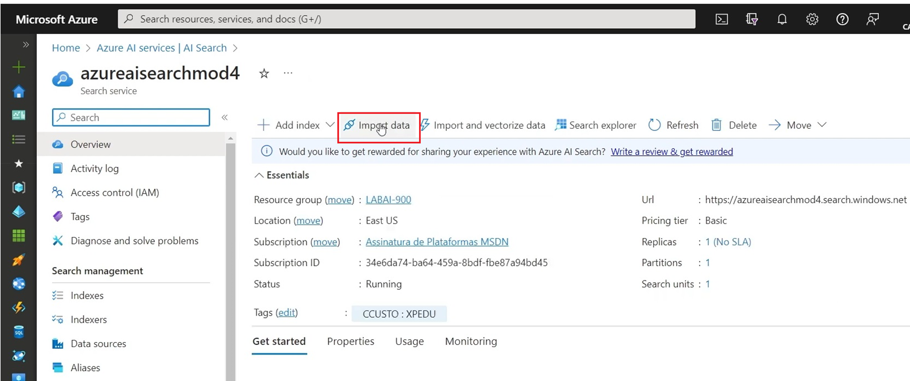 

    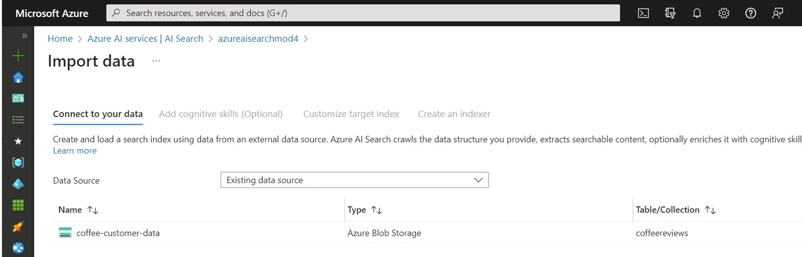 

2.	Na página Conectar-se aos seus dados, na lista Fonte de Dados, selecione Azure Blob Storage . 

    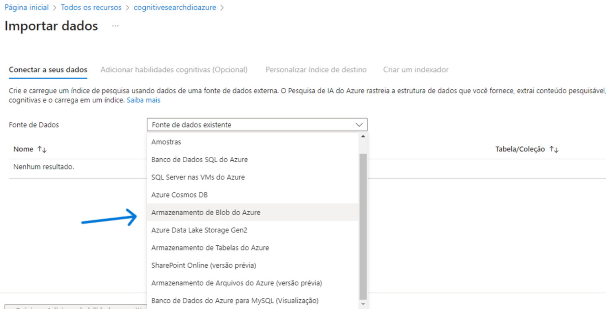 

3.	Conclua o armazenamento de dados detalhes com o seguindo valores :
- Fonte de dados: Azure Blob Storage
- Nome da fonte de dados: coffee-customer-data
- Dados a extrair: Conteúdo e metadados
- Análise modo: Padrão
- Cadeia de conexão: *Selecione Escolha uma conexão existente. Selecione sua conta de armazenamento, selecione o contêiner de avaliações de café e clique em Selecionar.
- Gerenciou identidade autenticação: Nenhuma
- Nome do contêiner: esta configuração é preenchida automaticamente depois que você escolhe uma conexão existente.
- Pasta Blob : deixe em branco .
- Descrição: Avaliações sobre Fourth Coffee Shops.
4.	Selecione Próximo: Adicionar habilidades cognitivas (opcional).
5.	Na secção Anexar Serviços Cognitivos, selecione o seu recurso de serviços Azure AI.
6.	Na seção Adicionar enriquecimentos :
- Altere o nome da qualificação para coffee-skillset .
- Marque a caixa de seleção Habilitar OCR e mesclar todo o texto no campo merged_content .
Nota É importante selecionar Habilitar OCR para ver todas as opções de campo enriquecido.
- Certifique-se de que o campo Dados de origem esteja configurado como merged_content .
- Altere o nível de granularidade de enriquecimento para Páginas (blocos de 5.000 caracteres) .
- Não selecione Habilitar enriquecimento incremental
- Selecione os seguintes campos enriquecidos:

| Cognitivo Habilidade | Nome do campo |
| ---|--- |
| Extrair localização nomes | Localizações |
| Extrair chave frases | frases chave |
| Detectar sentimento  | sentimento |
| Gerar Tag de imagens | imagemTags |
| Gerar legendas de imagens  | legenda da imagem |	

7.	Em Salvar enriquecimentos em um armazenamento de conhecimento , selecione:
- Imagem projeções
- Documentos
- Páginas
- Frases chave
- Entidades
- Imagem detalhes
- Imagem referências
Nota Se aparecer um aviso solicitando uma cadeia de conexão de conta de armazenamento .

    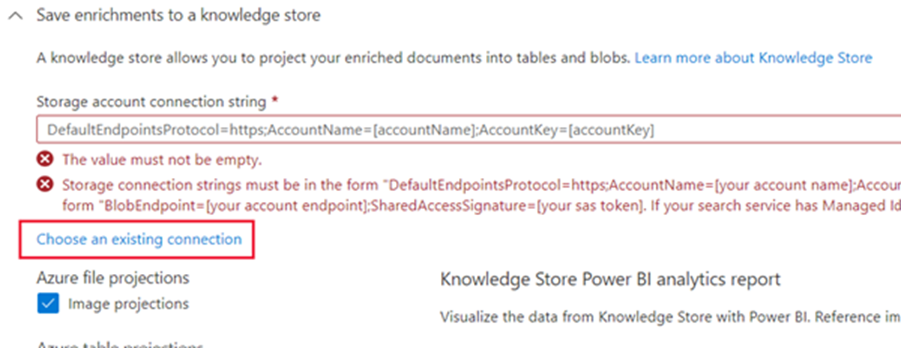 

h.	Selecione Escolha uma conexão existente . Escolha a conta de armazenamento que você criou anteriormente.
i.	Clique em + Container para criar um novo contêiner chamado armazenamento de conhecimento com o nível de privacidade definido como Private e selecione Create .
j.	Selecione o contêiner de armazenamento de conhecimento e clique em Selecionar na parte inferior da tela.
8.	Selecione projeções de blob do Azure: Documento. Uma configuração para o nome do contêiner com as exibições preenchidas automaticamente do contêiner de armazenamento de conhecimento. Não mudar o nome do contêiner .
9.	Selecione Próximo: Personalizar índice de destino. Altere o nome do índice para coffee-index .
10.	Certifique-se de que a chave esteja configurada como metadata_storage_path . Deixe o nome do sugeridor em branco e o modo de pesquisa preenchido automaticamente.
11.	Revise as configurações padrão dos campos de índice. Selecione filtrável para todos os campos que já estão selecionados por padrão.

    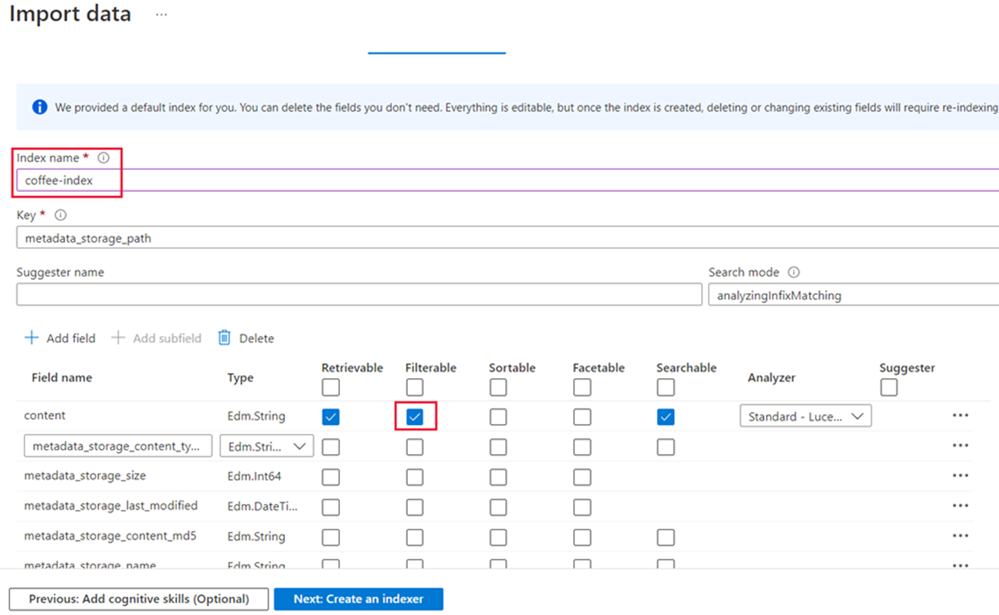 

12.	Selecione Próximo: Criar um indexador.
13.	Altere o nome do indexador para coffee-indexer .
14.	Deixe a programação definida como Once .
15.	Expanda as opções avançadas. Certifique-se de que a opção Base-64 Encode Keys esteja selecionada, pois as chaves de codificação podem tornar o índice mais eficiente.
16.	Selecione Enviar para criar a fonte de dados, o conjunto de habilidades, o índice e o indexador. O indexador é executado automaticamente e executa o pipeline de indexação, que:
- Extrai os campos de metadados do documento e o conteúdo da fonte de dados.
- Executa o conjunto de habilidades cognitivas para gerar campos mais enriquecidos.
- Mapeia os campos extraídos para o índice.
17.	Na metade inferior da página Visão geral do recurso Azure AI Search, selecione a guia Indexadores. Esta guia mostra o indexador de café recém-criado. Espere um minuto e selecione &orarr; Atualize até que o Status indique sucesso.
18.	Selecione o nome do indexador para ver mais detalhes.

    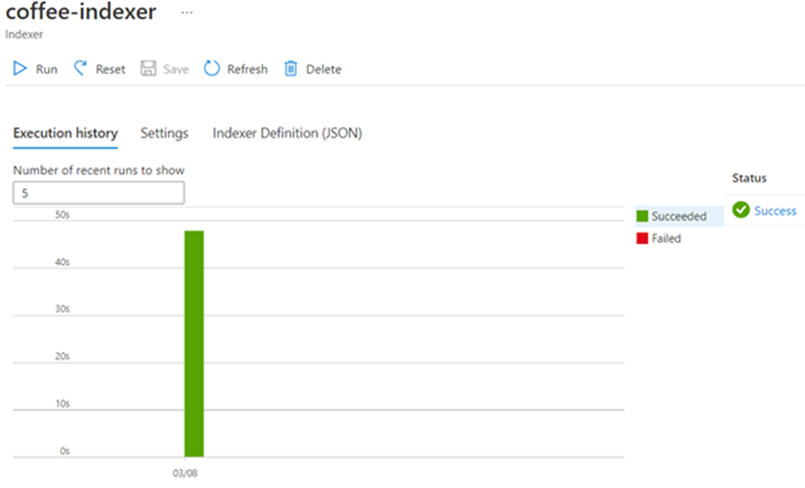 

## Consultar o índice

Use o Search Explorer para escrever e testar consultas. O explorador de pesquisa é uma ferramenta incorporada no portal do Azure que oferece uma maneira fácil de validar a qualidade do seu índice de pesquisa. Você pode usar o Search Explorer para escrever consultas e revisar resultados em JSON.
1.	Na página Visão geral do serviço de pesquisa, selecione Explorador de pesquisa na parte superior da tela.

     

2.	Observe como o índice selecionado é o índice de café que você criou.

    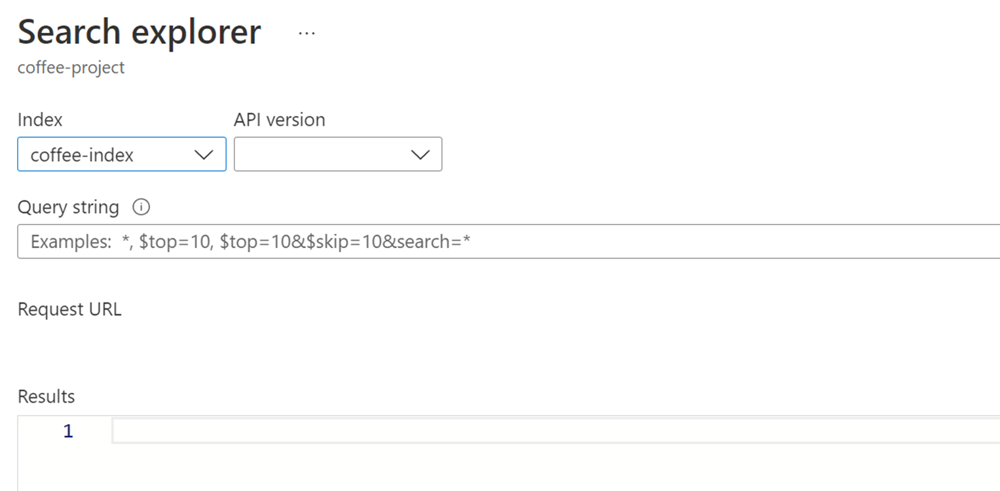 

No campo Cadeia de consulta, insira search=*&$count=true e selecione Pesquisar . A consulta de pesquisa retorna todos os documentos no índice de pesquisa, incluindo uma contagem de todos os documentos no campo @odata.count . O índice de pesquisa deve retornar um documento JSON contendo os resultados da pesquisa.

    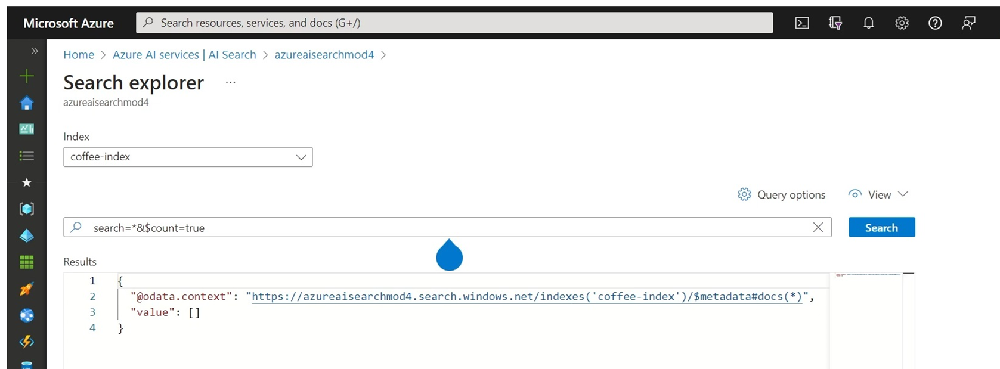 

Observação Se uma mensagem Para pesquisar no portal, permita a origem do portal nas configurações do índice CORS for exibida, selecione Permitir portal e, em seguida, selecione Pesquisar .
3.	Agora vamos filtrar por localização. Insira search=locations:'Chicago' no campo String de consulta e selecione Pesquisar. A consulta pesquisa todos os documentos no índice e filtra revisões com localização em Chicago.

    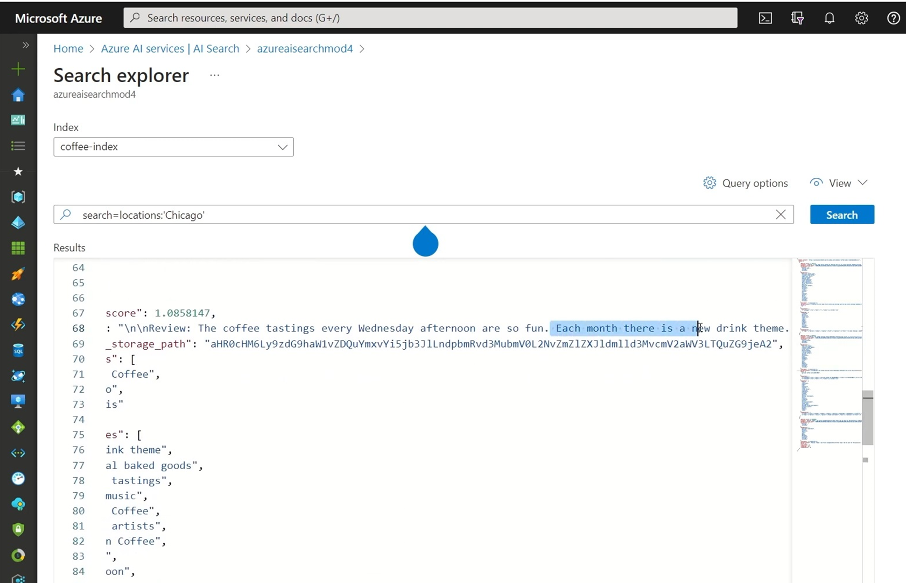 

4.	Agora vamos filtrar por sentimento. Insira search=sentiment:'negative' no campo String de consulta e selecione Pesquisar. A consulta pesquisa todos os documentos no índice e filtra revisões com sentimento negativo.
 

    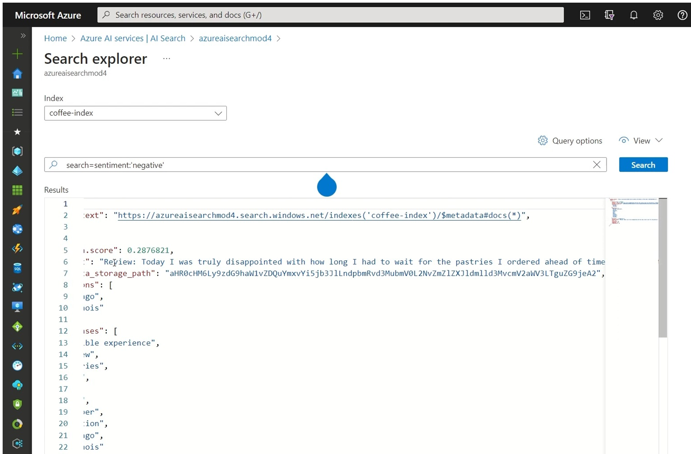 

Nota Veja como os resultados são classificados por @search.score . Esta é a pontuação atribuída pelo mecanismo de pesquisa para mostrar o quão próximos os resultados correspondem à consulta fornecida.
5.	Um dos problemas que podemos querer resolver é por que pode haver certas avaliações. Vamos dar uma olhada nas frases-chave associadas à avaliação negativa. O que você acha que pode ser a causa da revisão?

## Revise o armazenamento de conhecimento

Vamos ver o poder do armazenamento de conhecimento em ação. Ao executar o assistente Importar dados, você também criou um armazenamento de conhecimento. Dentro do armazenamento de conhecimento, você encontrará os dados enriquecidos extraídos pelas habilidades de IA que persistem na forma de projeções e tabelas.
1.	No portal do Azure, navegue de volta para a sua conta de armazenamento do Azure.
2.	No painel do menu esquerdo, selecione Containers. Selecione o contêiner de armazenamento de conhecimento.

    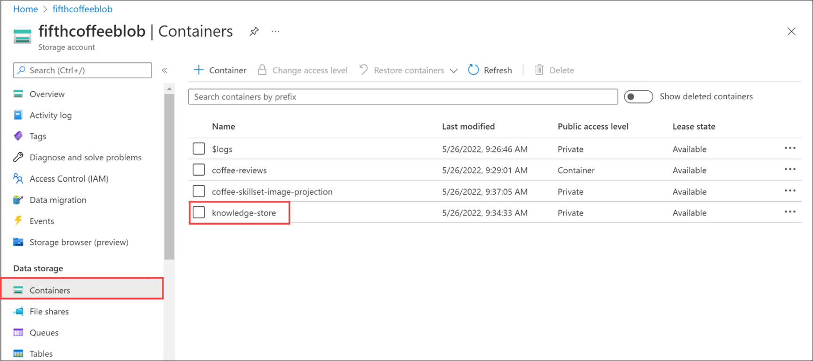 

3.	Selecione qualquer um dos itens e clique no arquivo objectprojection.json .

    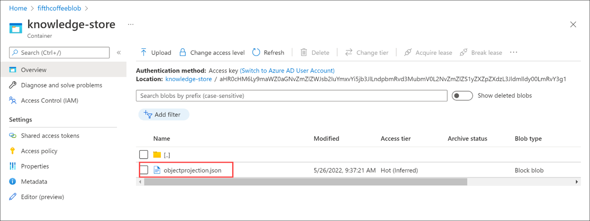 

4.	Selecione Editar para ver o JSON produzido para um dos documentos do seu armazenamento de dados do Azure.

    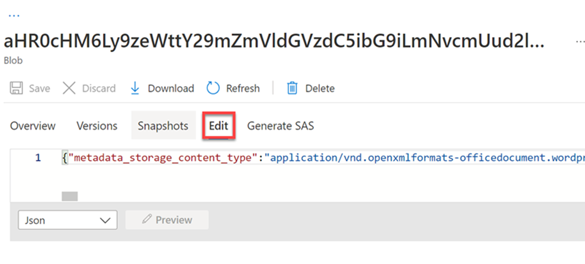 

5.	Selecione a localização atual do blob de armazenamento no canto superior esquerdo da tela para retornar à conta de armazenamento Containers .

    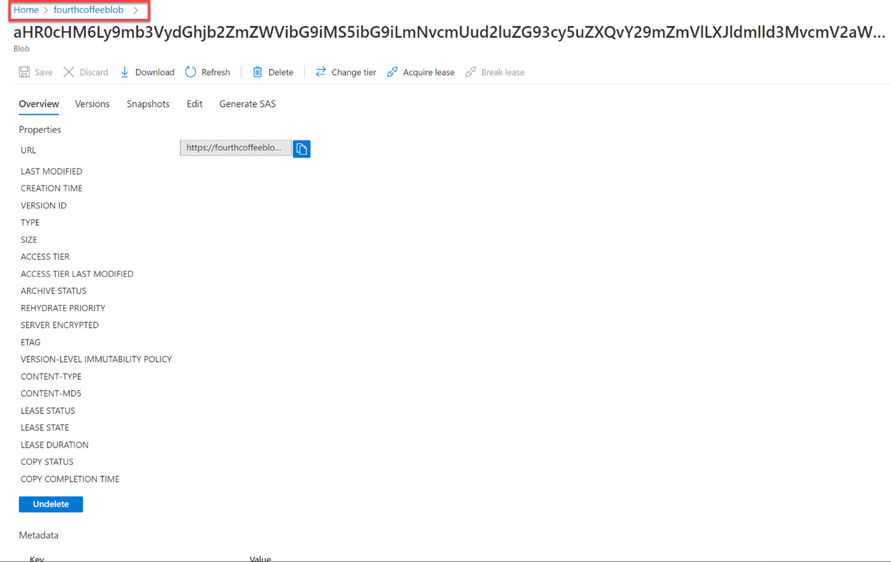 

6.	Em Containers , selecione o contêiner coffee-skillset-image-projection . Selecione qualquer de o Unid .

    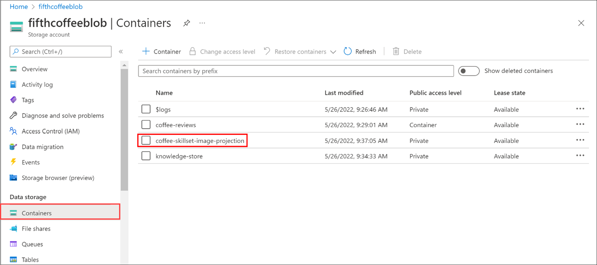 

7.	Selecione qualquer um dos arquivos .jpg . Selecione Editar para ver a imagem armazenada no documento. Observe como todas as imagens dos documentos são armazenadas desta forma.

    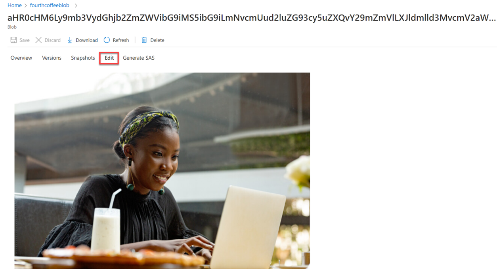 

8.	Selecione a localização atual do blob de armazenamento no canto superior esquerdo da tela para retornar à conta de armazenamento Containers.
9.	Selecione Navegador de armazenamento no painel esquerdo e selecione Tabelas. Há uma tabela para cada entidade no índice. Selecione a tabela coffeeSkillsetKeyPhrases .
Observe as frases-chave que o armazenamento de conhecimento conseguiu capturar do conteúdo das avaliações. Muitos dos campos são chaves, portanto você pode vincular as tabelas como um banco de dados relacional. O último campo mostra as frases-chave que foram extraídas pelo conjunto de habilidades.

## Excluir Grupo de Recursos 

- [Evite cobranças com a conta gratuita do Azure](https://github.com/shyoutarou/Microsoft-Azure-AI-Fundamentals/tree/master/Questoes)

Se não pretende fazer mais exercícios, exclua todos os recursos que não precisa mais. Esse evita acumulando qualquer desnecessário custos .

1. Acesse a página do portal e clique para abrir o menu lateral esquerdo:

    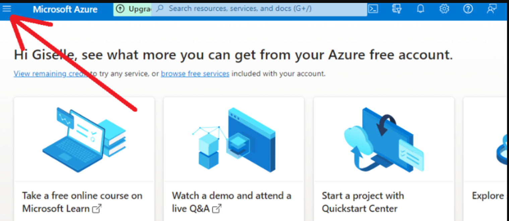 
     

 

2. Clique em "Resource Groups":

    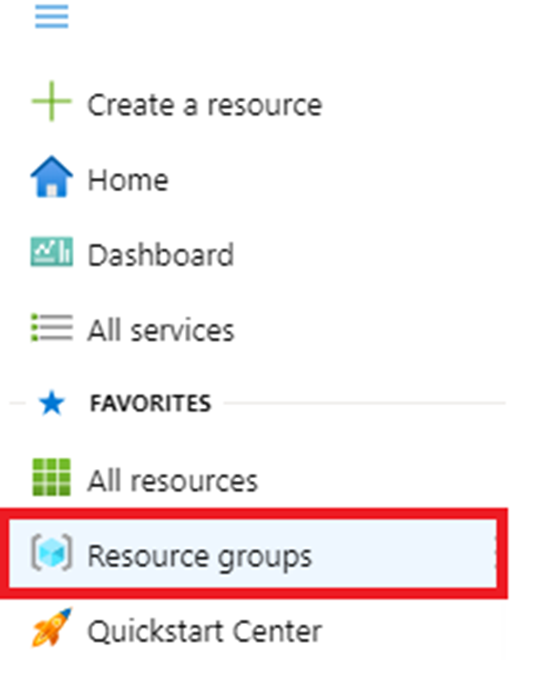 
     

 

3. Selecione o grupo que deseja deletar:

    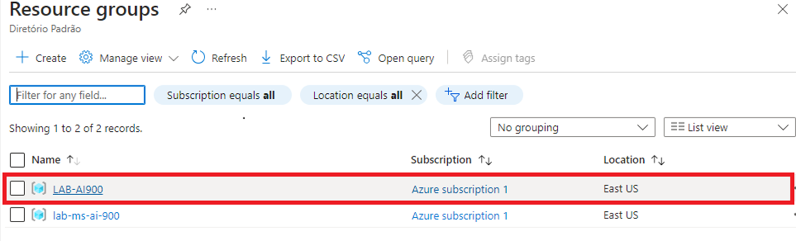 
     

 

4. No ambiente do recurso referido, clique em "Delete resource group":

    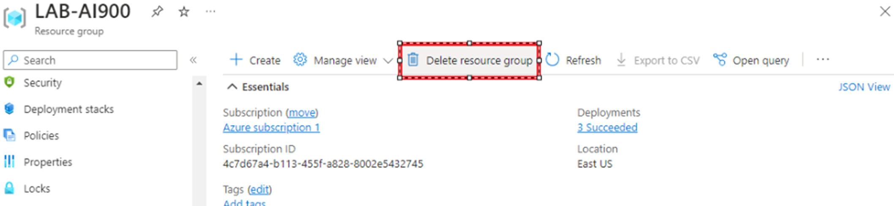 
     

 

5. Confirme as informações, informe o nome do recurso no campo abaixo e clique em delete:

     
     

 

6. Confirme a exclusão:

    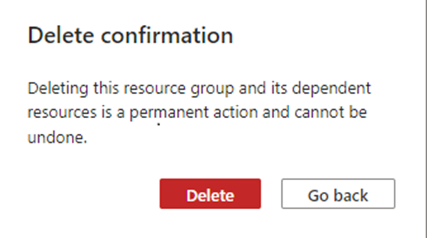 
     

 

Obs.: A exclusão pode demorar um pouco para acontecer. Aguarde um pouco e confira que o recurso foi excluído dando um refresh (F5) na página para que a lista de grupos de recursos seja atualizada.

## Não encontrou sua resposta aqui? Tente esses repositórios...

### Repos Auxiliares
- [giselle-ferreira](https://github.com/giselle-ferreira/ai-search-microsoft-azure)
- [alexklenio](https://github.com/alexklenio/DIO-Microsoft-Azure-AI-Fundamentals/tree/main/DP04%20-%20Azure%20Cognitive%20Search)
- [miguelfmds](https://github.com/miguelfmds/bootcamp-microsoft-azure-ai-fundamentals/tree/main/LAB04%20-%20Cognitive%20Search)
- [wvdomingos](https://github.com/wvdomingos/DIO-Microsoft-Azure-AI-Fundamentals/tree/main/DP04%20-%20Azure%20Cognitive%20Search)
- [michaelssilva](https://github.com/michaelssilva/Bootcamp-DIO-AI-900/tree/main/Desafio%204)
- [casjunior93](https://github.com/casjunior93/Projeto-DIO---Utilizando-AI-Search-para-indexa--o-e-consulta-de-Dados)

## 📜 License

O projeto publicado em 2024 sobre a licença [MIT](./LICENSE) ❤️ 

Made with ❤️ by Shyoutarou

Gostou? Deixe uma estrelinha para ajudar o projeto ⭐

